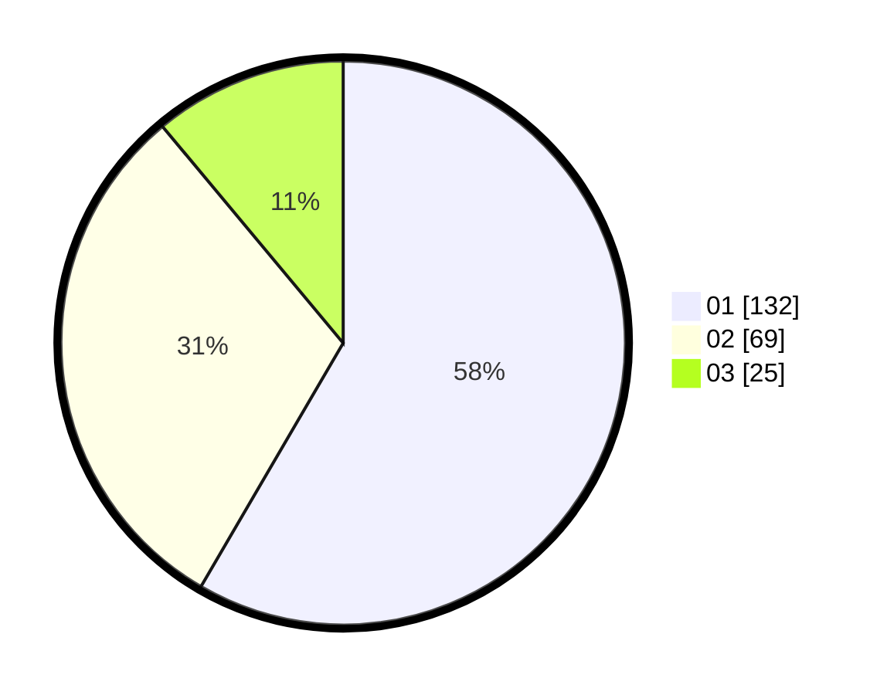

# Hasil

Hasil perolehan suara paslon dapat dilihat pada file paslon-01.txt, paslon-02.txt, dan paslon-03.txt.

Jika tidak ada, artinya data tersebut belum ada pada SIREKAP.

## Perolehan Suara

 * Paslon 01: **132**.
 * Paslon 02: **69**.
 * Paslon 03: **25**.

## Foto C Plano

https://sirekap-obj-formc.kpu.go.id/0ec0/pemilu/ppwp/31/71/03/10/08/3171031008022-20240214-211909--ff86a8ed-3d69-4c65-90cb-2dba8767fea4.jpg

https://sirekap-obj-formc.kpu.go.id/0ec0/pemilu/ppwp/31/71/03/10/08/3171031008022-20240214-211844--d346d85e-1b5d-4c71-ab08-99b2561c0770.jpg

https://sirekap-obj-formc.kpu.go.id/0ec0/pemilu/ppwp/31/71/03/10/08/3171031008022-20240214-212027--24cc2468-0fb8-4021-b1f4-151d77384500.jpg
