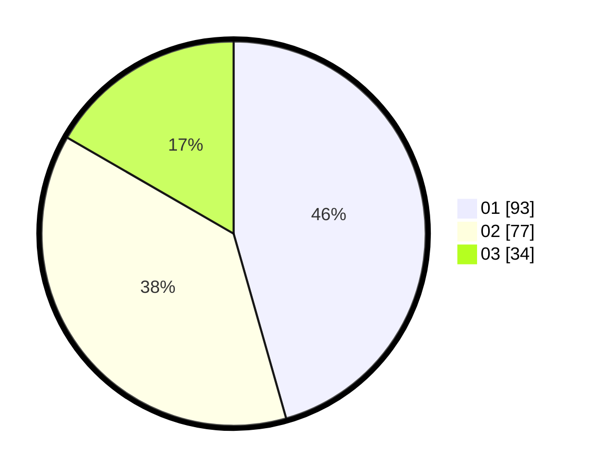

# Hasil

Hasil perolehan suara paslon dapat dilihat pada file paslon-01.txt, paslon-02.txt, dan paslon-03.txt.

Jika tidak ada, artinya data tersebut belum ada pada SIREKAP.

## Perolehan Suara

 * Paslon 01: **93**.
 * Paslon 02: **77**.
 * Paslon 03: **34**.

## Foto C Plano

https://sirekap-obj-formc.kpu.go.id/c1e5/pemilu/ppwp/31/71/03/10/08/3171031008023-20240214-190322--d65ffef7-4502-4c55-9b5d-38a1d0b8043f.jpg

https://sirekap-obj-formc.kpu.go.id/c1e5/pemilu/ppwp/31/71/03/10/08/3171031008023-20240214-190023--15faf80f-9685-4429-a2a2-7eef46da118d.jpg

https://sirekap-obj-formc.kpu.go.id/c1e5/pemilu/ppwp/31/71/03/10/08/3171031008023-20240214-190459--7b884a96-88e6-4496-9d20-0be674573cb0.jpg

## DATA PEMILIH TETAP

Jumlah pemilih dalam DPT: **281**.
 * L: **136**.
 * P: **145**.

## DATA PENGGUNA HAK PILIH

Jumlah pengguna hak pilih dalam DPT: **197**.
 * L: **94**.
 * P: **103**.

Jumlah pengguna hak pilih dalam DPTb: **9**.
 * L: **6**.
 * P: **3**.

Jumlah pengguna hak pilih dalam DPK: **0**.
 * L: **0**.
 * P: **0**.

Jumlah pengguna hak pilih: **206**.
 * L: **100**.
 * P: **106**.

## JUMLAH SUARA SAH DAN TIDAK SAH

JUMLAH SELURUH SUARA SAH: **204**.

JUMLAH SUARA TIDAK SAH: **2**.

JUMLAH SELURUH SUARA SAH DAN SUARA TIDAK SAH: **206**.
