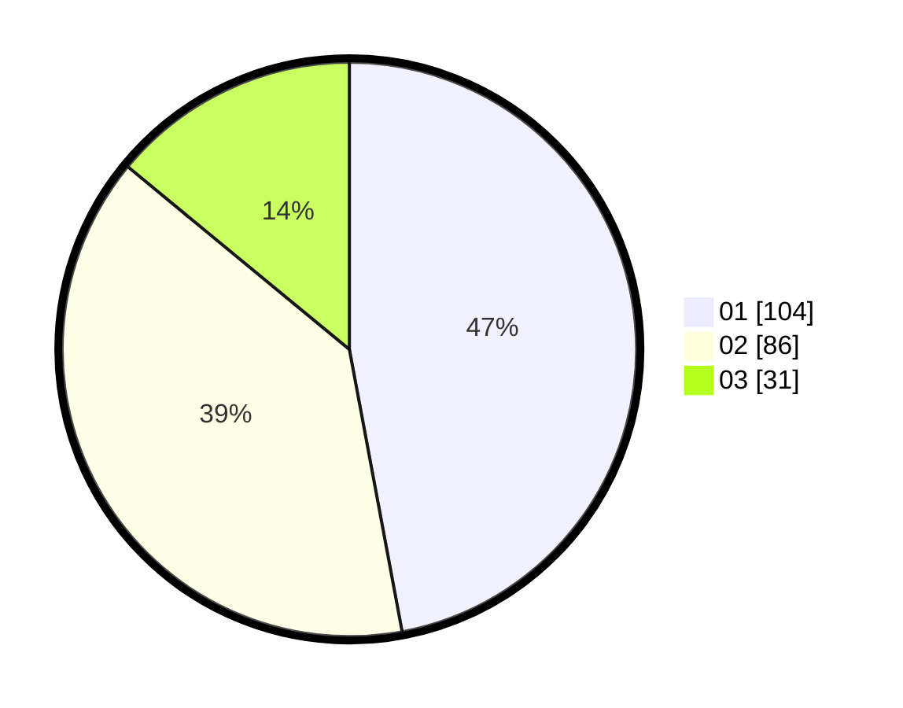

# Hasil

Hasil perolehan suara paslon dapat dilihat pada file paslon-01.txt, paslon-02.txt, dan paslon-03.txt.

Jika tidak ada, artinya data tersebut belum ada pada SIREKAP.

## Perolehan Suara

 * Paslon 01: **104**.
 * Paslon 02: **86**.
 * Paslon 03: **31**.

## Foto C Plano

https://sirekap-obj-formc.kpu.go.id/584f/pemilu/ppwp/31/71/03/10/08/3171031008026-20240216-135705--d59c8e5b-18d0-42a6-afc7-f71dad69105d.jpg

https://sirekap-obj-formc.kpu.go.id/584f/pemilu/ppwp/31/71/03/10/08/3171031008026-20240216-135706--31c6b256-f5eb-4795-b4d5-af7656c88643.jpg

https://sirekap-obj-formc.kpu.go.id/584f/pemilu/ppwp/31/71/03/10/08/3171031008026-20240216-135706--a573bd7c-47d0-4e70-b7a9-876b477eea52.jpg

## DATA PEMILIH TETAP

Jumlah pemilih dalam DPT: **288**.
 * L: **147**.
 * P: **141**.

## DATA PENGGUNA HAK PILIH

Jumlah pengguna hak pilih dalam DPT: **222**.
 * L: **110**.
 * P: **112**.

Jumlah pengguna hak pilih dalam DPTb: **4**.
 * L: **2**.
 * P: **2**.

Jumlah pengguna hak pilih dalam DPK: **0**.
 * L: **0**.
 * P: **0**.

Jumlah pengguna hak pilih: **226**.
 * L: **112**.
 * P: **114**.

## JUMLAH SUARA SAH DAN TIDAK SAH

JUMLAH SELURUH SUARA SAH: **221**.

JUMLAH SUARA TIDAK SAH: **5**.

JUMLAH SELURUH SUARA SAH DAN SUARA TIDAK SAH: **226**.
