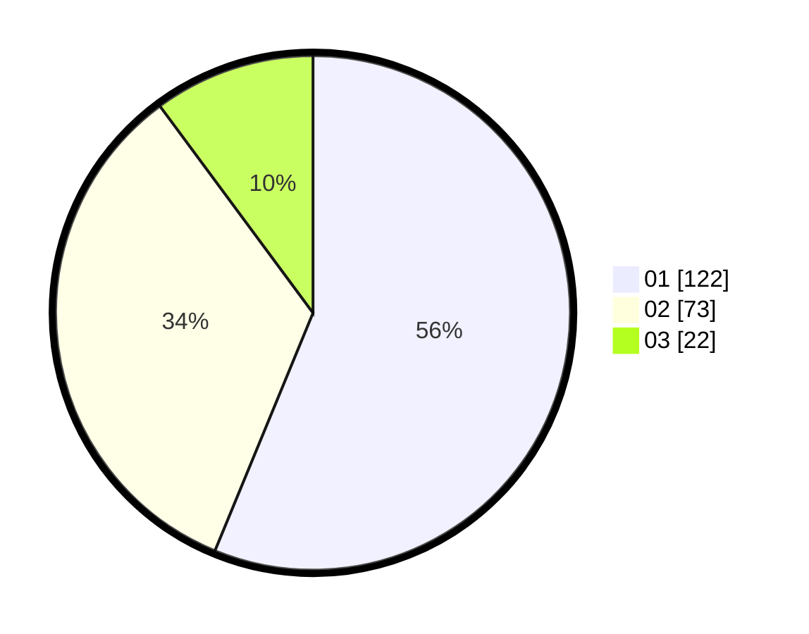

# Hasil

Hasil perolehan suara paslon dapat dilihat pada file paslon-01.txt, paslon-02.txt, dan paslon-03.txt.

Jika tidak ada, artinya data tersebut belum ada pada SIREKAP.

## Perolehan Suara

 * Paslon 01: **122**.
 * Paslon 02: **73**.
 * Paslon 03: **22**.

## Foto C Plano

https://sirekap-obj-formc.kpu.go.id/fd0e/pemilu/ppwp/31/71/03/10/08/3171031008027-20240214-215036--ba25a419-7ca3-4ca5-be20-6460d6a04080.jpg

https://sirekap-obj-formc.kpu.go.id/fd0e/pemilu/ppwp/31/71/03/10/08/3171031008027-20240214-215057--c7c149aa-3752-4726-8eb2-e8240d54e54f.jpg

https://sirekap-obj-formc.kpu.go.id/fd0e/pemilu/ppwp/31/71/03/10/08/3171031008027-20240214-215047--2f78da9c-b22e-4819-994f-5353232772e9.jpg

## DATA PEMILIH TETAP

Jumlah pemilih dalam DPT: **283**.
 * L: **135**.
 * P: **148**.

## DATA PENGGUNA HAK PILIH

Jumlah pengguna hak pilih dalam DPT: **211**.
 * L: **96**.
 * P: **115**.

Jumlah pengguna hak pilih dalam DPTb: **10**.
 * L: **4**.
 * P: **6**.

Jumlah pengguna hak pilih dalam DPK: **0**.
 * L: **0**.
 * P: **0**.

Jumlah pengguna hak pilih: **221**.
 * L: **100**.
 * P: **121**.

## JUMLAH SUARA SAH DAN TIDAK SAH

JUMLAH SELURUH SUARA SAH: **217**.

JUMLAH SUARA TIDAK SAH: **4**.

JUMLAH SELURUH SUARA SAH DAN SUARA TIDAK SAH: **221**.
