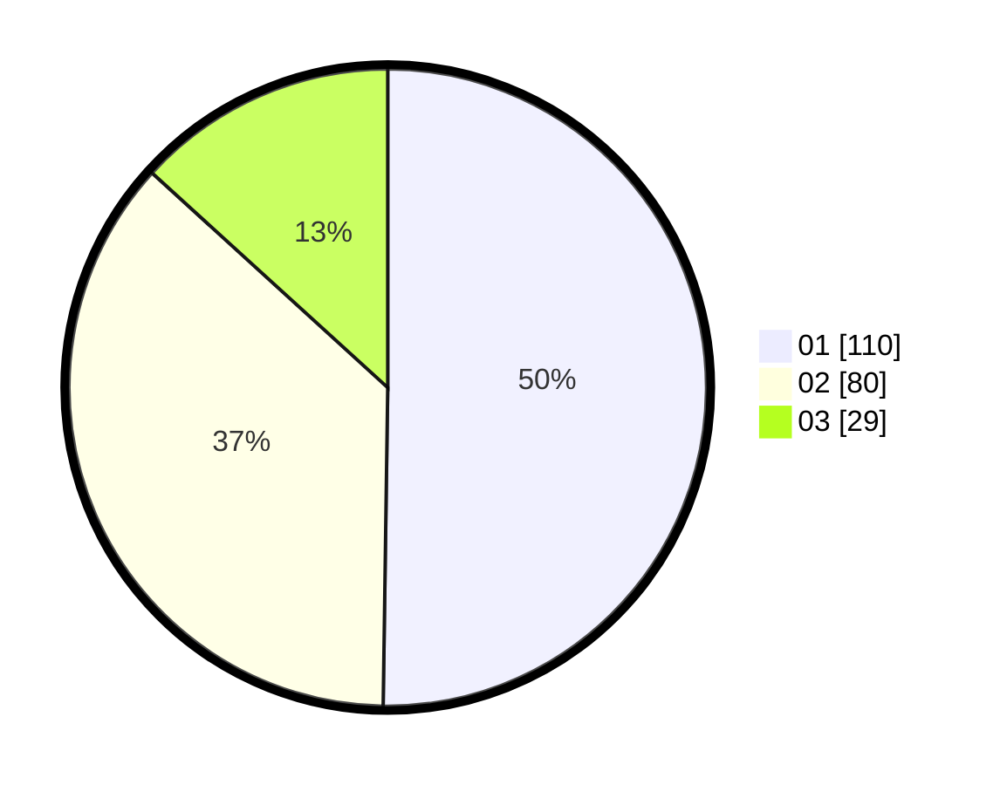

# Hasil

Hasil perolehan suara paslon dapat dilihat pada file paslon-01.txt, paslon-02.txt, dan paslon-03.txt.

Jika tidak ada, artinya data tersebut belum ada pada SIREKAP.

## Perolehan Suara

 * Paslon 01: **110**.
 * Paslon 02: **80**.
 * Paslon 03: **29**.

## Foto C Plano

https://sirekap-obj-formc.kpu.go.id/93c0/pemilu/ppwp/31/71/03/10/08/3171031008028-20240214-191440--4c0e2971-3947-4887-b913-f99189b13ce5.jpg

https://sirekap-obj-formc.kpu.go.id/93c0/pemilu/ppwp/31/71/03/10/08/3171031008028-20240214-191552--fd864816-feb7-41f3-82be-0b7b5a0a176b.jpg

https://sirekap-obj-formc.kpu.go.id/93c0/pemilu/ppwp/31/71/03/10/08/3171031008028-20240214-191626--4c9f62a9-65dd-49d4-bf5e-ffaafef70d5c.jpg

## DATA PEMILIH TETAP

Jumlah pemilih dalam DPT: **280**.
 * L: **139**.
 * P: **141**.

## DATA PENGGUNA HAK PILIH

Jumlah pengguna hak pilih dalam DPT: **212**.
 * L: **104**.
 * P: **108**.

Jumlah pengguna hak pilih dalam DPTb: **8**.
 * L: **3**.
 * P: **5**.

Jumlah pengguna hak pilih dalam DPK: **1**.
 * L: **1**.
 * P: **0**.

Jumlah pengguna hak pilih: **221**.
 * L: **108**.
 * P: **113**.

## JUMLAH SUARA SAH DAN TIDAK SAH

JUMLAH SELURUH SUARA SAH: **219**.

JUMLAH SUARA TIDAK SAH: **2**.

JUMLAH SELURUH SUARA SAH DAN SUARA TIDAK SAH: **221**.
