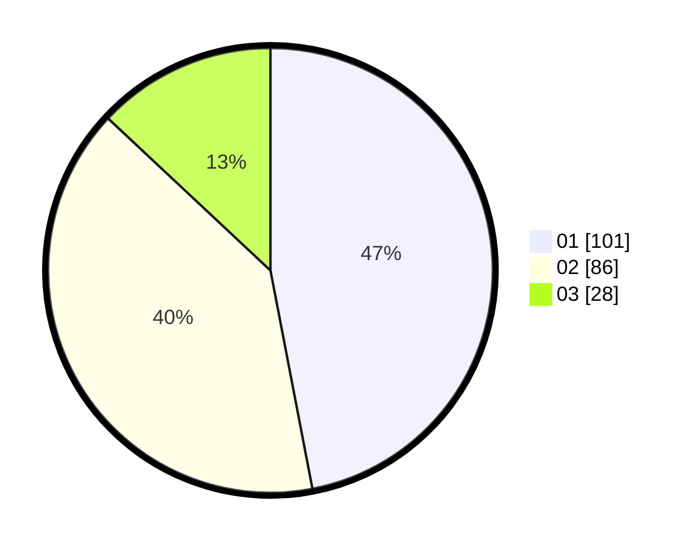

# Hasil

Hasil perolehan suara paslon dapat dilihat pada file paslon-01.txt, paslon-02.txt, dan paslon-03.txt.

Jika tidak ada, artinya data tersebut belum ada pada SIREKAP.

## Perolehan Suara

 * Paslon 01: **101**.
 * Paslon 02: **86**.
 * Paslon 03: **28**.

## Foto C Plano

https://sirekap-obj-formc.kpu.go.id/11dd/pemilu/ppwp/31/71/03/10/08/3171031008029-20240214-193426--f398121a-a0f4-44d8-a609-f31fc7cb0e45.jpg

https://sirekap-obj-formc.kpu.go.id/11dd/pemilu/ppwp/31/71/03/10/08/3171031008029-20240214-193530--7421f9f5-40bb-4179-9b13-1fcdee8852f8.jpg

https://sirekap-obj-formc.kpu.go.id/11dd/pemilu/ppwp/31/71/03/10/08/3171031008029-20240214-193632--d2b39494-4062-4a7f-820f-da462b317673.jpg

## DATA PEMILIH TETAP

Jumlah pemilih dalam DPT: **286**.
 * L: **146**.
 * P: **140**.

## DATA PENGGUNA HAK PILIH

Jumlah pengguna hak pilih dalam DPT: **210**.
 * L: **99**.
 * P: **111**.

Jumlah pengguna hak pilih dalam DPTb: **8**.
 * L: **5**.
 * P: **3**.

Jumlah pengguna hak pilih dalam DPK: **1**.
 * L: **1**.
 * P: **0**.

Jumlah pengguna hak pilih: **219**.
 * L: **105**.
 * P: **114**.

## JUMLAH SUARA SAH DAN TIDAK SAH

JUMLAH SELURUH SUARA SAH: **215**.

JUMLAH SUARA TIDAK SAH: **4**.

JUMLAH SELURUH SUARA SAH DAN SUARA TIDAK SAH: **219**.
