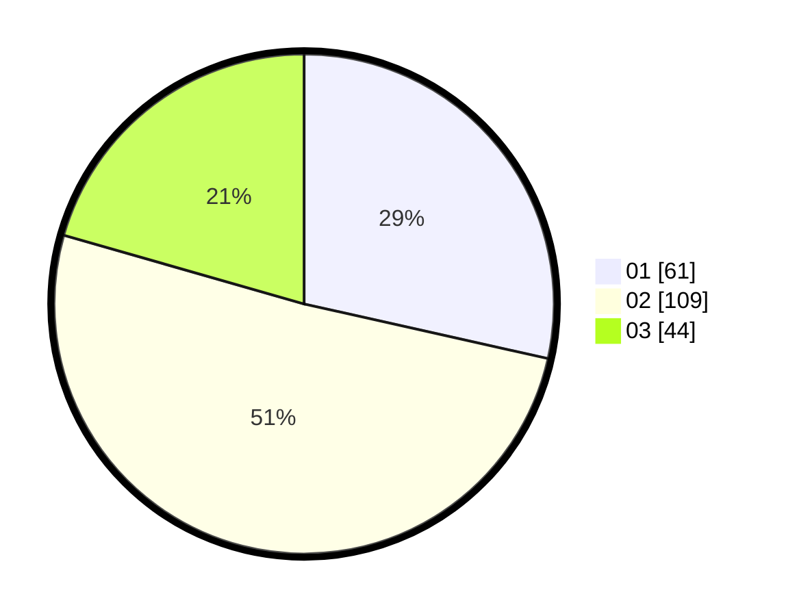

# Hasil

Hasil perolehan suara paslon dapat dilihat pada file paslon-01.txt, paslon-02.txt, dan paslon-03.txt.

Jika tidak ada, artinya data tersebut belum ada pada SIREKAP.

## Perolehan Suara

 * Paslon 01: **61**.
 * Paslon 02: **109**.
 * Paslon 03: **44**.

## Foto C Plano

https://sirekap-obj-formc.kpu.go.id/17fa/pemilu/ppwp/31/71/03/10/08/3171031008032-20240214-192819--52ff489d-0b3d-4847-96af-00274220344d.jpg

https://sirekap-obj-formc.kpu.go.id/17fa/pemilu/ppwp/31/71/03/10/08/3171031008032-20240214-191923--153ffc1b-6587-4b40-a0b9-3a997cf18265.jpg

https://sirekap-obj-formc.kpu.go.id/17fa/pemilu/ppwp/31/71/03/10/08/3171031008032-20240214-192023--d1b9804d-8895-4ad5-850b-e1996235511f.jpg

## DATA PEMILIH TETAP

Jumlah pemilih dalam DPT: **211**.
 * L: **100**.
 * P: **111**.

## DATA PENGGUNA HAK PILIH

Jumlah pengguna hak pilih dalam DPT: **211**.
 * L: **100**.
 * P: **111**.

Jumlah pengguna hak pilih dalam DPTb: **4**.
 * L: **2**.
 * P: **2**.

Jumlah pengguna hak pilih dalam DPK: **2**.
 * L: **1**.
 * P: **1**.

Jumlah pengguna hak pilih: **217**.
 * L: **103**.
 * P: **114**.

## JUMLAH SUARA SAH DAN TIDAK SAH

JUMLAH SELURUH SUARA SAH: **214**.

JUMLAH SUARA TIDAK SAH: **3**.

JUMLAH SELURUH SUARA SAH DAN SUARA TIDAK SAH: **217**.
