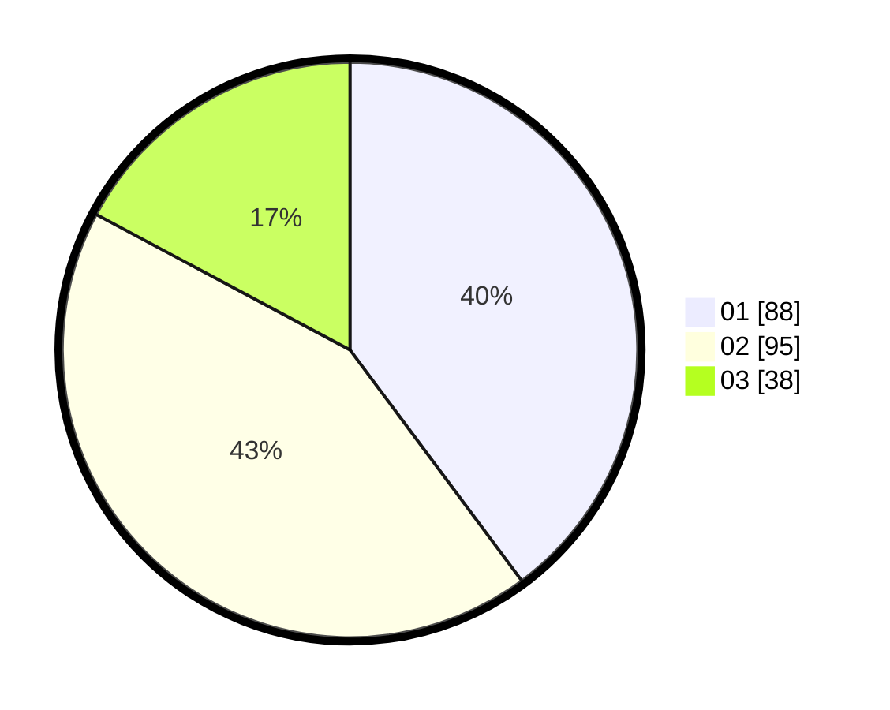

# Hasil

Hasil perolehan suara paslon dapat dilihat pada file paslon-01.txt, paslon-02.txt, dan paslon-03.txt.

Jika tidak ada, artinya data tersebut belum ada pada SIREKAP.

## Perolehan Suara

 * Paslon 01: **88**.
 * Paslon 02: **95**.
 * Paslon 03: **38**.

## Foto C Plano

https://sirekap-obj-formc.kpu.go.id/10f8/pemilu/ppwp/31/71/03/10/08/3171031008033-20240216-193615--fd3d50ca-c1ad-4d80-8bd5-f35c882e4243.jpg

https://sirekap-obj-formc.kpu.go.id/10f8/pemilu/ppwp/31/71/03/10/08/3171031008033-20240216-193617--60c08cd2-f723-4897-b948-7769b667f20e.jpg

https://sirekap-obj-formc.kpu.go.id/10f8/pemilu/ppwp/31/71/03/10/08/3171031008033-20240216-193616--8e5796e8-3601-4fab-bc19-6727e66dd8a0.jpg

## DATA PEMILIH TETAP

Jumlah pemilih dalam DPT: **283**.
 * L: **135**.
 * P: **148**.

## DATA PENGGUNA HAK PILIH

Jumlah pengguna hak pilih dalam DPT: **214**.
 * L: **100**.
 * P: **114**.

Jumlah pengguna hak pilih dalam DPTb: **6**.
 * L: **3**.
 * P: **3**.

Jumlah pengguna hak pilih dalam DPK: **4**.
 * L: **2**.
 * P: **2**.

Jumlah pengguna hak pilih: **224**.
 * L: **105**.
 * P: **119**.

## JUMLAH SUARA SAH DAN TIDAK SAH

JUMLAH SELURUH SUARA SAH: **221**.

JUMLAH SUARA TIDAK SAH: **2**.

JUMLAH SELURUH SUARA SAH DAN SUARA TIDAK SAH: **223**.
