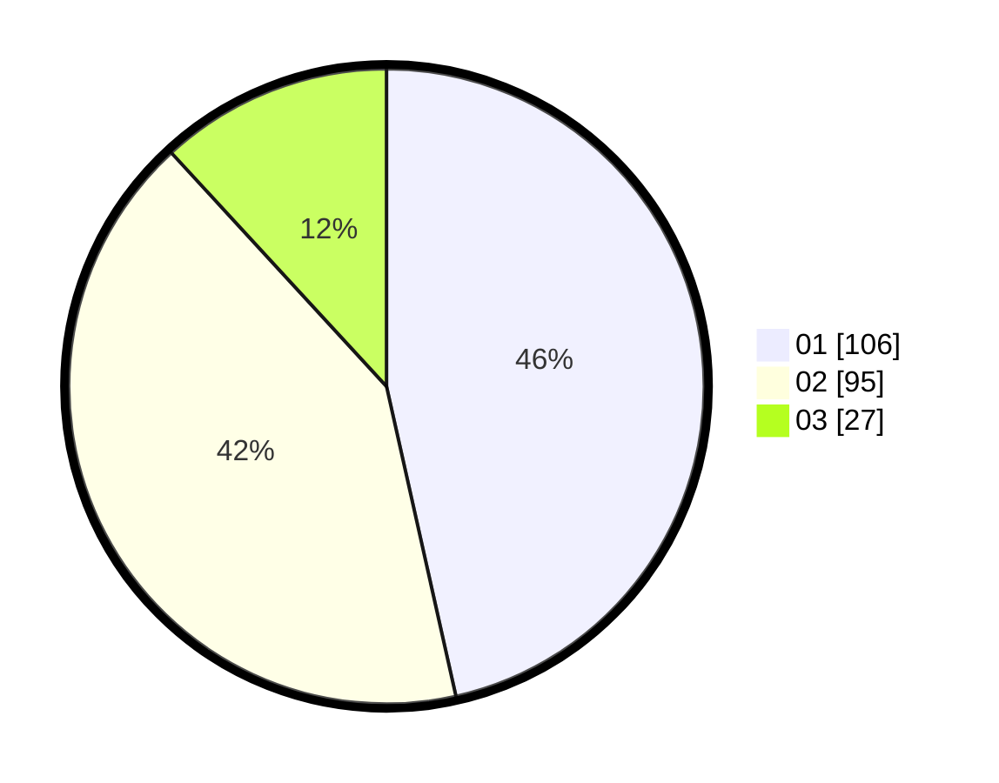

# Hasil

Hasil perolehan suara paslon dapat dilihat pada file paslon-01.txt, paslon-02.txt, dan paslon-03.txt.

Jika tidak ada, artinya data tersebut belum ada pada SIREKAP.

## Perolehan Suara

 * Paslon 01: **106**.
 * Paslon 02: **95**.
 * Paslon 03: **27**.

## Foto C Plano

https://sirekap-obj-formc.kpu.go.id/a17b/pemilu/ppwp/31/71/03/10/08/3171031008038-20240216-190410--8c474ee9-8214-425b-9a51-36a422fd27fa.jpg

https://sirekap-obj-formc.kpu.go.id/a17b/pemilu/ppwp/31/71/03/10/08/3171031008038-20240216-190412--ba621955-e98b-4c95-8472-3400c6b0ce59.jpg

https://sirekap-obj-formc.kpu.go.id/a17b/pemilu/ppwp/31/71/03/10/08/3171031008038-20240216-190411--46ee380e-abf8-4b3b-b9d2-f0891a59a029.jpg

## DATA PEMILIH TETAP

Jumlah pemilih dalam DPT: **278**.
 * L: **144**.
 * P: **134**.

## DATA PENGGUNA HAK PILIH

Jumlah pengguna hak pilih dalam DPT: **232**.
 * L: **117**.
 * P: **115**.

Jumlah pengguna hak pilih dalam DPTb: **4**.
 * L: **4**.
 * P: **0**.

Jumlah pengguna hak pilih dalam DPK: **0**.
 * L: **0**.
 * P: **0**.

Jumlah pengguna hak pilih: **236**.
 * L: **121**.
 * P: **115**.

## JUMLAH SUARA SAH DAN TIDAK SAH

JUMLAH SELURUH SUARA SAH: **228**.

JUMLAH SUARA TIDAK SAH: **8**.

JUMLAH SELURUH SUARA SAH DAN SUARA TIDAK SAH: **236**.
