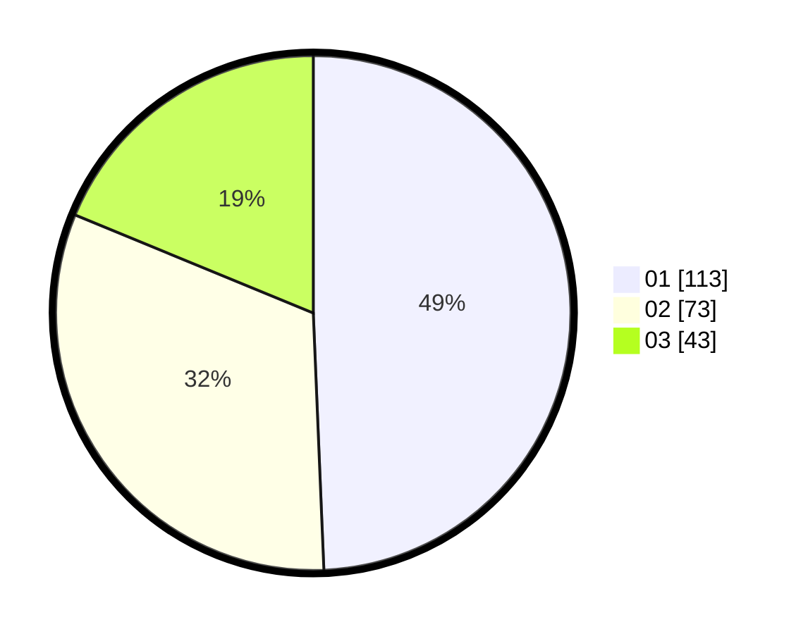

# Hasil

Hasil perolehan suara paslon dapat dilihat pada file paslon-01.txt, paslon-02.txt, dan paslon-03.txt.

Jika tidak ada, artinya data tersebut belum ada pada SIREKAP.

## Perolehan Suara

 * Paslon 01: **113**.
 * Paslon 02: **73**.
 * Paslon 03: **43**.

## Foto C Plano

https://sirekap-obj-formc.kpu.go.id/5adb/pemilu/ppwp/31/71/03/10/08/3171031008041-20240215-015450--9094a005-f8a9-4d32-8bbf-bd960e07dffd.jpg

https://sirekap-obj-formc.kpu.go.id/5adb/pemilu/ppwp/31/71/03/10/08/3171031008041-20240215-015550--fb1a6f29-b00f-434e-b2bc-2862a4a5a143.jpg

https://sirekap-obj-formc.kpu.go.id/5adb/pemilu/ppwp/31/71/03/10/08/3171031008041-20240215-015752--bbe274f2-091a-49fa-86ca-3864172ed3a4.jpg

## DATA PEMILIH TETAP

Jumlah pemilih dalam DPT: **291**.
 * L: **145**.
 * P: **146**.

## DATA PENGGUNA HAK PILIH

Jumlah pengguna hak pilih dalam DPT: **230**.
 * L: **111**.
 * P: **119**.

Jumlah pengguna hak pilih dalam DPTb: **2**.
 * L: **2**.
 * P: **0**.

Jumlah pengguna hak pilih dalam DPK: **0**.
 * L: **0**.
 * P: **0**.

Jumlah pengguna hak pilih: **232**.
 * L: **113**.
 * P: **119**.

## JUMLAH SUARA SAH DAN TIDAK SAH

JUMLAH SELURUH SUARA SAH: **229**.

JUMLAH SUARA TIDAK SAH: **3**.

JUMLAH SELURUH SUARA SAH DAN SUARA TIDAK SAH: **232**.
