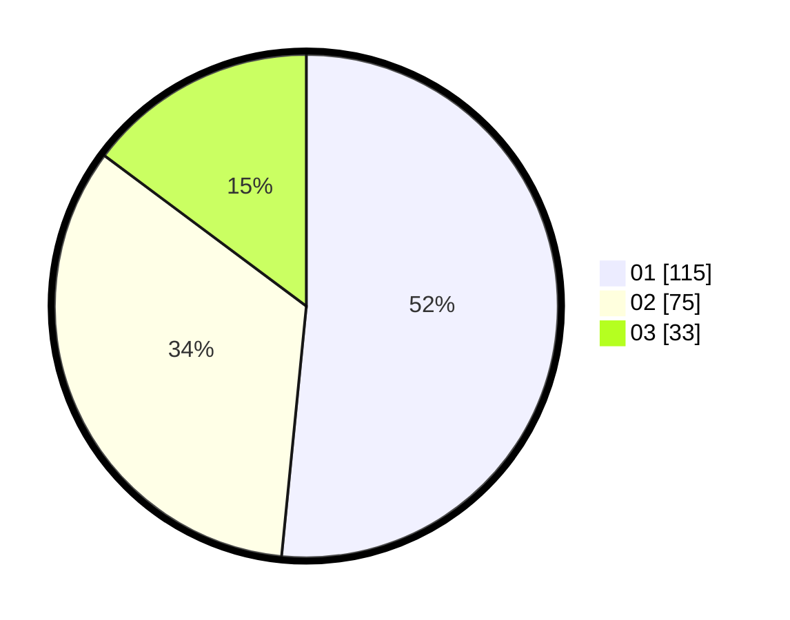

# Hasil

Hasil perolehan suara paslon dapat dilihat pada file paslon-01.txt, paslon-02.txt, dan paslon-03.txt.

Jika tidak ada, artinya data tersebut belum ada pada SIREKAP.

## Perolehan Suara

 * Paslon 01: **115**.
 * Paslon 02: **75**.
 * Paslon 03: **33**.

## Foto C Plano

https://sirekap-obj-formc.kpu.go.id/503e/pemilu/ppwp/31/71/03/10/08/3171031008042-20240214-204655--c3c9bce2-1ba4-4dd6-8dfd-a83b27b95af3.jpg

https://sirekap-obj-formc.kpu.go.id/503e/pemilu/ppwp/31/71/03/10/08/3171031008042-20240214-200241--4940caf7-8121-48fb-a68d-7f6f97ea7c7d.jpg

https://sirekap-obj-formc.kpu.go.id/503e/pemilu/ppwp/31/71/03/10/08/3171031008042-20240214-200450--e951fd8e-b758-4e4d-be0d-b97302b2dbba.jpg

## DATA PEMILIH TETAP

Jumlah pemilih dalam DPT: **286**.
 * L: **141**.
 * P: **145**.

## DATA PENGGUNA HAK PILIH

Jumlah pengguna hak pilih dalam DPT: **222**.
 * L: **105**.
 * P: **117**.

Jumlah pengguna hak pilih dalam DPTb: **4**.
 * L: **2**.
 * P: **2**.

Jumlah pengguna hak pilih dalam DPK: **0**.
 * L: **0**.
 * P: **0**.

Jumlah pengguna hak pilih: **226**.
 * L: **107**.
 * P: **119**.

## JUMLAH SUARA SAH DAN TIDAK SAH

JUMLAH SELURUH SUARA SAH: **223**.

JUMLAH SUARA TIDAK SAH: **3**.

JUMLAH SELURUH SUARA SAH DAN SUARA TIDAK SAH: **226**.
