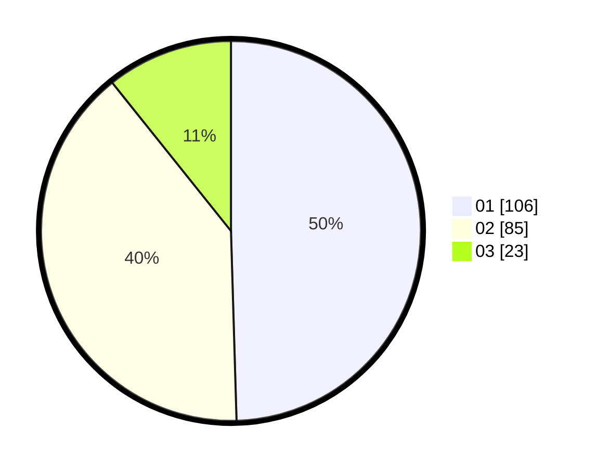

# Hasil

Hasil perolehan suara paslon dapat dilihat pada file paslon-01.txt, paslon-02.txt, dan paslon-03.txt.

Jika tidak ada, artinya data tersebut belum ada pada SIREKAP.

## Perolehan Suara

 * Paslon 01: **106**.
 * Paslon 02: **85**.
 * Paslon 03: **23**.

## Foto C Plano

https://sirekap-obj-formc.kpu.go.id/5def/pemilu/ppwp/31/71/03/10/08/3171031008047-20240215-064225--e37e38e1-9e58-4685-933c-c4c346066542.jpg

https://sirekap-obj-formc.kpu.go.id/5def/pemilu/ppwp/31/71/03/10/08/3171031008047-20240215-064250--a3afa2b6-74e7-424c-81b4-0581c56ff8e9.jpg

https://sirekap-obj-formc.kpu.go.id/5def/pemilu/ppwp/31/71/03/10/08/3171031008047-20240215-064237--d9214e6b-fae4-4be7-b164-caf7e3554f6c.jpg

## DATA PEMILIH TETAP

Jumlah pemilih dalam DPT: **270**.
 * L: **135**.
 * P: **135**.

## DATA PENGGUNA HAK PILIH

Jumlah pengguna hak pilih dalam DPT: **212**.
 * L: **100**.
 * P: **112**.

Jumlah pengguna hak pilih dalam DPTb: **8**.
 * L: **3**.
 * P: **5**.

Jumlah pengguna hak pilih dalam DPK: **0**.
 * L: **0**.
 * P: **0**.

Jumlah pengguna hak pilih: **220**.
 * L: **103**.
 * P: **117**.

## JUMLAH SUARA SAH DAN TIDAK SAH

JUMLAH SELURUH SUARA SAH: **214**.

JUMLAH SUARA TIDAK SAH: **6**.

JUMLAH SELURUH SUARA SAH DAN SUARA TIDAK SAH: **220**.
