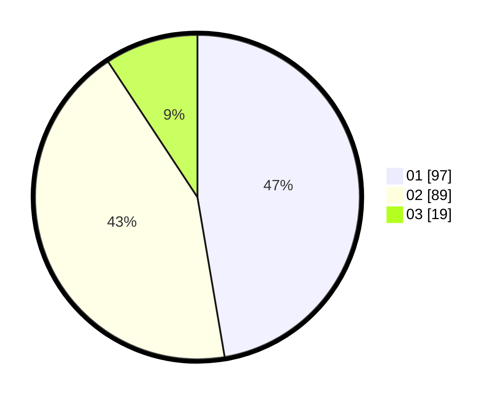

# Hasil

Hasil perolehan suara paslon dapat dilihat pada file paslon-01.txt, paslon-02.txt, dan paslon-03.txt.

Jika tidak ada, artinya data tersebut belum ada pada SIREKAP.

## Perolehan Suara

 * Paslon 01: **97**.
 * Paslon 02: **89**.
 * Paslon 03: **19**.

## Foto C Plano

https://sirekap-obj-formc.kpu.go.id/b4b0/pemilu/ppwp/31/71/03/10/08/3171031008051-20240216-010243--f80921e5-ed8b-4d4c-a0fa-4f28d43240ec.jpg

https://sirekap-obj-formc.kpu.go.id/b4b0/pemilu/ppwp/31/71/03/10/08/3171031008051-20240216-010244--69c3130d-0c70-4462-9a53-1eb0fc26fd46.jpg

https://sirekap-obj-formc.kpu.go.id/b4b0/pemilu/ppwp/31/71/03/10/08/3171031008051-20240216-010244--83b98627-893a-4253-acba-e10b884bd592.jpg

## DATA PEMILIH TETAP

Jumlah pemilih dalam DPT: **0**.
 * L: **0**.
 * P: **0**.

## DATA PENGGUNA HAK PILIH

Jumlah pengguna hak pilih dalam DPT: **0**.
 * L: **0**.
 * P: **0**.

Jumlah pengguna hak pilih dalam DPTb: **0**.
 * L: **0**.
 * P: **0**.

Jumlah pengguna hak pilih dalam DPK: **0**.
 * L: **0**.
 * P: **0**.

Jumlah pengguna hak pilih: **0**.
 * L: **0**.
 * P: **0**.

## JUMLAH SUARA SAH DAN TIDAK SAH

JUMLAH SELURUH SUARA SAH: **205**.

JUMLAH SUARA TIDAK SAH: **5**.

JUMLAH SELURUH SUARA SAH DAN SUARA TIDAK SAH: **210**.
