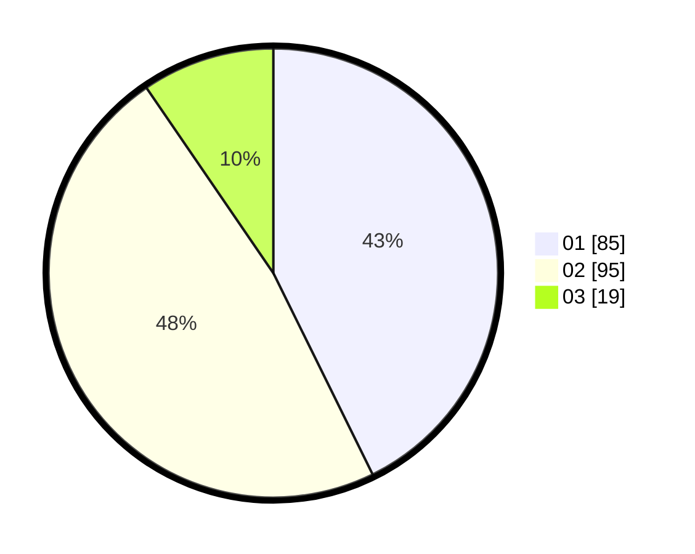

# Hasil

Hasil perolehan suara paslon dapat dilihat pada file paslon-01.txt, paslon-02.txt, dan paslon-03.txt.

Jika tidak ada, artinya data tersebut belum ada pada SIREKAP.

## Perolehan Suara

 * Paslon 01: **85**.
 * Paslon 02: **95**.
 * Paslon 03: **19**.

## Foto C Plano

https://sirekap-obj-formc.kpu.go.id/9186/pemilu/ppwp/31/71/03/10/08/3171031008054-20240216-190441--c721f10a-f3e5-4ec3-884e-179909d16ff4.jpg

https://sirekap-obj-formc.kpu.go.id/9186/pemilu/ppwp/31/71/03/10/08/3171031008054-20240216-190443--6d92ca47-ccca-4806-babf-ceb71a9310b8.jpg

https://sirekap-obj-formc.kpu.go.id/9186/pemilu/ppwp/31/71/03/10/08/3171031008054-20240216-190442--83adbd32-bcfc-402e-9ec7-ad00c24c0617.jpg

## DATA PEMILIH TETAP

Jumlah pemilih dalam DPT: **271**.
 * L: **136**.
 * P: **135**.

## DATA PENGGUNA HAK PILIH

Jumlah pengguna hak pilih dalam DPT: **195**.
 * L: **99**.
 * P: **96**.

Jumlah pengguna hak pilih dalam DPTb: **6**.
 * L: **2**.
 * P: **4**.

Jumlah pengguna hak pilih dalam DPK: **0**.
 * L: **0**.
 * P: **0**.

Jumlah pengguna hak pilih: **201**.
 * L: **101**.
 * P: **100**.

## JUMLAH SUARA SAH DAN TIDAK SAH

JUMLAH SELURUH SUARA SAH: **199**.

JUMLAH SUARA TIDAK SAH: **2**.

JUMLAH SELURUH SUARA SAH DAN SUARA TIDAK SAH: **201**.
