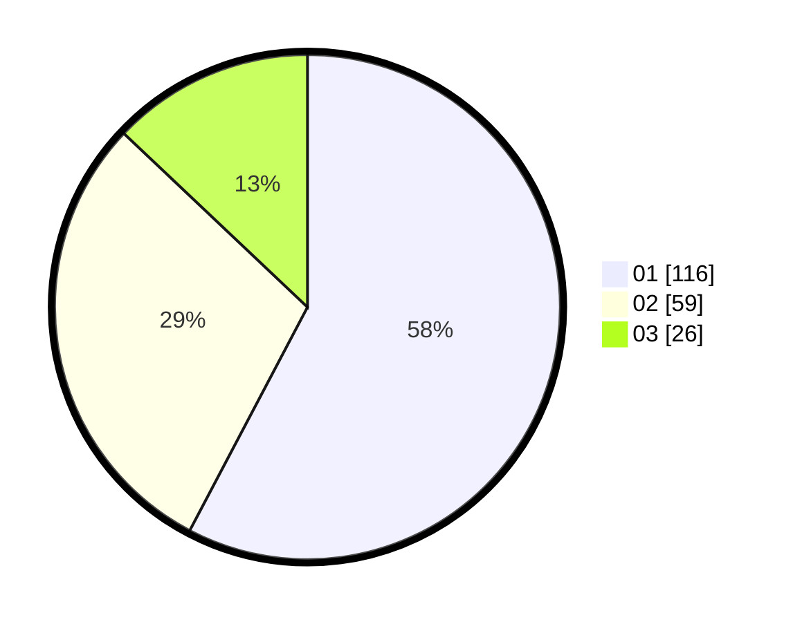

# Hasil

Hasil perolehan suara paslon dapat dilihat pada file paslon-01.txt, paslon-02.txt, dan paslon-03.txt.

Jika tidak ada, artinya data tersebut belum ada pada SIREKAP.

## Perolehan Suara

 * Paslon 01: **116**.
 * Paslon 02: **59**.
 * Paslon 03: **26**.

## Foto C Plano

https://sirekap-obj-formc.kpu.go.id/96b2/pemilu/ppwp/31/71/03/10/08/3171031008055-20240214-191110--62149bc5-35f5-4ab9-ac4c-7db460eb2f94.jpg

https://sirekap-obj-formc.kpu.go.id/96b2/pemilu/ppwp/31/71/03/10/08/3171031008055-20240214-191249--1e84f2f1-bd83-420c-9368-6b244c09172a.jpg

https://sirekap-obj-formc.kpu.go.id/96b2/pemilu/ppwp/31/71/03/10/08/3171031008055-20240214-191539--e62b536e-f70a-4cd1-abf4-9a9bda23d037.jpg

## DATA PEMILIH TETAP

Jumlah pemilih dalam DPT: **268**.
 * L: **135**.
 * P: **133**.

## DATA PENGGUNA HAK PILIH

Jumlah pengguna hak pilih dalam DPT: **193**.
 * L: **95**.
 * P: **98**.

Jumlah pengguna hak pilih dalam DPTb: **11**.
 * L: **6**.
 * P: **5**.

Jumlah pengguna hak pilih dalam DPK: **0**.
 * L: **0**.
 * P: **0**.

Jumlah pengguna hak pilih: **204**.
 * L: **101**.
 * P: **103**.

## JUMLAH SUARA SAH DAN TIDAK SAH

JUMLAH SELURUH SUARA SAH: **201**.

JUMLAH SUARA TIDAK SAH: **3**.

JUMLAH SELURUH SUARA SAH DAN SUARA TIDAK SAH: **204**.
