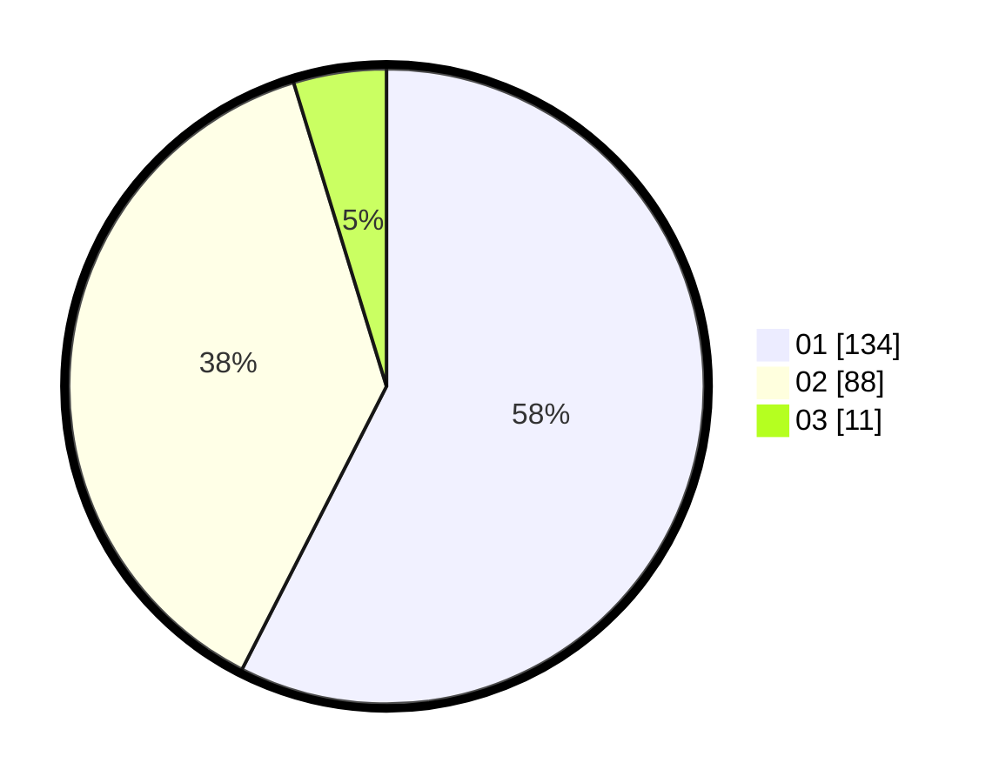

# Hasil

Hasil perolehan suara paslon dapat dilihat pada file paslon-01.txt, paslon-02.txt, dan paslon-03.txt.

Jika tidak ada, artinya data tersebut belum ada pada SIREKAP.

## Perolehan Suara

 * Paslon 01: **134**.
 * Paslon 02: **88**.
 * Paslon 03: **11**.

## Foto C Plano

https://sirekap-obj-formc.kpu.go.id/1baf/pemilu/ppwp/31/71/03/10/08/3171031008061-20240214-191044--827bfb10-4fcd-4bef-86d5-fc06c2775739.jpg

https://sirekap-obj-formc.kpu.go.id/1baf/pemilu/ppwp/31/71/03/10/08/3171031008061-20240214-191807--e73ae5ab-90fa-4766-a071-84aa73b770a1.jpg

https://sirekap-obj-formc.kpu.go.id/1baf/pemilu/ppwp/31/71/03/10/08/3171031008061-20240214-191951--69ad53f5-8907-4561-9e0d-c54d7420ebb3.jpg

## DATA PEMILIH TETAP

Jumlah pemilih dalam DPT: **284**.
 * L: **138**.
 * P: **146**.

## DATA PENGGUNA HAK PILIH

Jumlah pengguna hak pilih dalam DPT: **236**.
 * L: **116**.
 * P: **120**.

Jumlah pengguna hak pilih dalam DPTb: **0**.
 * L: **0**.
 * P: **0**.

Jumlah pengguna hak pilih dalam DPK: **0**.
 * L: **0**.
 * P: **0**.

Jumlah pengguna hak pilih: **236**.
 * L: **116**.
 * P: **120**.

## JUMLAH SUARA SAH DAN TIDAK SAH

JUMLAH SELURUH SUARA SAH: **233**.

JUMLAH SUARA TIDAK SAH: **3**.

JUMLAH SELURUH SUARA SAH DAN SUARA TIDAK SAH: **236**.
