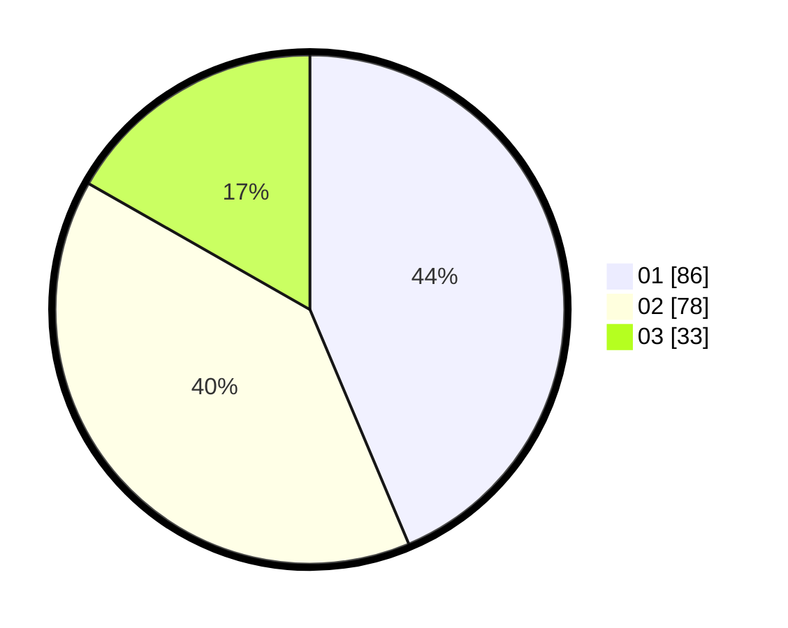

# Hasil

Hasil perolehan suara paslon dapat dilihat pada file paslon-01.txt, paslon-02.txt, dan paslon-03.txt.

Jika tidak ada, artinya data tersebut belum ada pada SIREKAP.

## Perolehan Suara

 * Paslon 01: **86**.
 * Paslon 02: **78**.
 * Paslon 03: **33**.

## Foto C Plano

https://sirekap-obj-formc.kpu.go.id/b85c/pemilu/ppwp/31/71/03/10/08/3171031008065-20240216-203502--2179d710-970b-4c04-828d-738d9c3de115.jpg

https://sirekap-obj-formc.kpu.go.id/b85c/pemilu/ppwp/31/71/03/10/08/3171031008065-20240216-203504--53e7d4b8-2770-43cf-904a-0693df2fbdbd.jpg

https://sirekap-obj-formc.kpu.go.id/b85c/pemilu/ppwp/31/71/03/10/08/3171031008065-20240216-203503--567788f8-ec3d-4255-b91a-6862c3ae5832.jpg

## DATA PEMILIH TETAP

Jumlah pemilih dalam DPT: **274**.
 * L: **145**.
 * P: **129**.

## DATA PENGGUNA HAK PILIH

Jumlah pengguna hak pilih dalam DPT: **201**.
 * L: **106**.
 * P: **95**.

Jumlah pengguna hak pilih dalam DPTb: **0**.
 * L: **0**.
 * P: **0**.

Jumlah pengguna hak pilih dalam DPK: **1**.
 * L: **1**.
 * P: **0**.

Jumlah pengguna hak pilih: **202**.
 * L: **107**.
 * P: **95**.

## JUMLAH SUARA SAH DAN TIDAK SAH

JUMLAH SELURUH SUARA SAH: **197**.

JUMLAH SUARA TIDAK SAH: **5**.

JUMLAH SELURUH SUARA SAH DAN SUARA TIDAK SAH: **202**.
