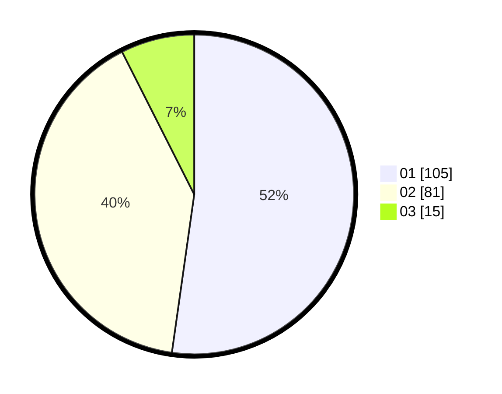

# Hasil

Hasil perolehan suara paslon dapat dilihat pada file paslon-01.txt, paslon-02.txt, dan paslon-03.txt.

Jika tidak ada, artinya data tersebut belum ada pada SIREKAP.

## Perolehan Suara

 * Paslon 01: **105**.
 * Paslon 02: **81**.
 * Paslon 03: **15**.

## Foto C Plano

https://sirekap-obj-formc.kpu.go.id/70ac/pemilu/ppwp/31/71/03/10/08/3171031008068-20240215-211330--d0015b46-466e-4f07-bc38-6ffa2bf8c9a3.jpg

https://sirekap-obj-formc.kpu.go.id/70ac/pemilu/ppwp/31/71/03/10/08/3171031008068-20240215-211333--5f48abed-d592-4da3-84e0-4821619a7db0.jpg

https://sirekap-obj-formc.kpu.go.id/70ac/pemilu/ppwp/31/71/03/10/08/3171031008068-20240215-211331--0ea7e414-346b-474c-86bb-4f4c9600088c.jpg

## DATA PEMILIH TETAP

Jumlah pemilih dalam DPT: **271**.
 * L: **140**.
 * P: **131**.

## DATA PENGGUNA HAK PILIH

Jumlah pengguna hak pilih dalam DPT: **203**.
 * L: **103**.
 * P: **100**.

Jumlah pengguna hak pilih dalam DPTb: **0**.
 * L: **0**.
 * P: **0**.

Jumlah pengguna hak pilih dalam DPK: **1**.
 * L: **1**.
 * P: **0**.

Jumlah pengguna hak pilih: **204**.
 * L: **104**.
 * P: **100**.

## JUMLAH SUARA SAH DAN TIDAK SAH

JUMLAH SELURUH SUARA SAH: **201**.

JUMLAH SUARA TIDAK SAH: **3**.

JUMLAH SELURUH SUARA SAH DAN SUARA TIDAK SAH: **204**.
