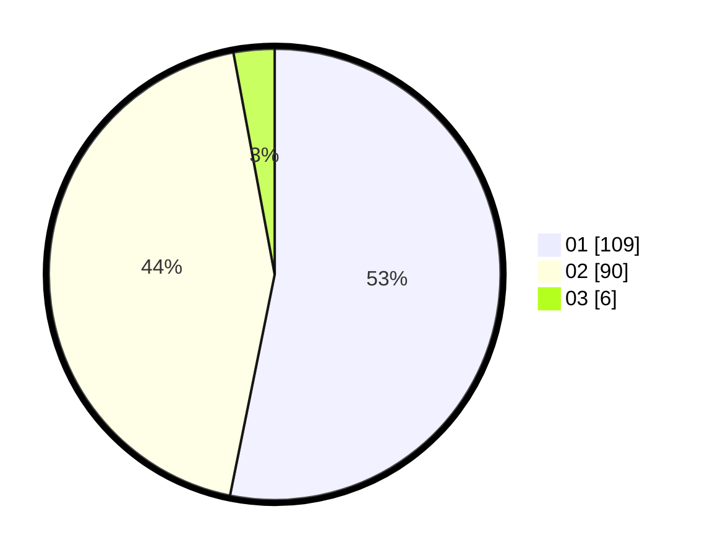

# Hasil

Hasil perolehan suara paslon dapat dilihat pada file paslon-01.txt, paslon-02.txt, dan paslon-03.txt.

Jika tidak ada, artinya data tersebut belum ada pada SIREKAP.

## Perolehan Suara

 * Paslon 01: **109**.
 * Paslon 02: **90**.
 * Paslon 03: **6**.

## Foto C Plano

https://sirekap-obj-formc.kpu.go.id/05e0/pemilu/ppwp/31/71/03/10/08/3171031008069-20240215-083255--3f1becf1-ad44-4c04-a2b7-ae7ecd2ed82c.jpg

https://sirekap-obj-formc.kpu.go.id/05e0/pemilu/ppwp/31/71/03/10/08/3171031008069-20240215-083316--0dd321d2-e832-474a-b03d-5999fa02496b.jpg

https://sirekap-obj-formc.kpu.go.id/05e0/pemilu/ppwp/31/71/03/10/08/3171031008069-20240215-083306--27584d92-a802-4a51-a22d-9c6b01645fbf.jpg

## DATA PEMILIH TETAP

Jumlah pemilih dalam DPT: **273**.
 * L: **145**.
 * P: **128**.

## DATA PENGGUNA HAK PILIH

Jumlah pengguna hak pilih dalam DPT: **207**.
 * L: **111**.
 * P: **96**.

Jumlah pengguna hak pilih dalam DPTb: **1**.
 * L: **1**.
 * P: **0**.

Jumlah pengguna hak pilih dalam DPK: **1**.
 * L: **0**.
 * P: **1**.

Jumlah pengguna hak pilih: **209**.
 * L: **112**.
 * P: **97**.

## JUMLAH SUARA SAH DAN TIDAK SAH

JUMLAH SELURUH SUARA SAH: **205**.

JUMLAH SUARA TIDAK SAH: **4**.

JUMLAH SELURUH SUARA SAH DAN SUARA TIDAK SAH: **209**.
