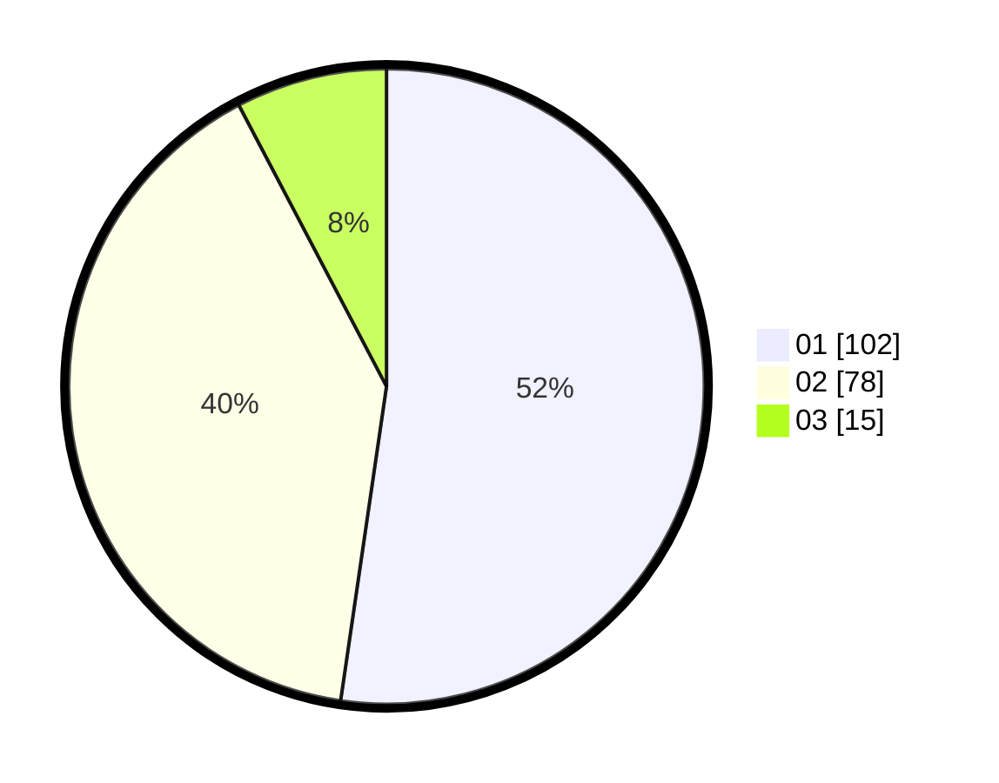

# Hasil

Hasil perolehan suara paslon dapat dilihat pada file paslon-01.txt, paslon-02.txt, dan paslon-03.txt.

Jika tidak ada, artinya data tersebut belum ada pada SIREKAP.

## Perolehan Suara

 * Paslon 01: **102**.
 * Paslon 02: **78**.
 * Paslon 03: **15**.

## Foto C Plano

https://sirekap-obj-formc.kpu.go.id/f915/pemilu/ppwp/31/71/03/10/08/3171031008072-20240215-121604--2fc294c5-f34b-42ac-8823-3baca473c58c.jpg

https://sirekap-obj-formc.kpu.go.id/f915/pemilu/ppwp/31/71/03/10/08/3171031008072-20240215-121625--0f63125f-1217-4160-bb04-b322c86944c1.jpg

https://sirekap-obj-formc.kpu.go.id/f915/pemilu/ppwp/31/71/03/10/08/3171031008072-20240215-121615--2c687733-7b22-49c9-8d5c-8d30be56c908.jpg

## DATA PEMILIH TETAP

Jumlah pemilih dalam DPT: **271**.
 * L: **130**.
 * P: **141**.

## DATA PENGGUNA HAK PILIH

Jumlah pengguna hak pilih dalam DPT: **192**.
 * L: **86**.
 * P: **106**.

Jumlah pengguna hak pilih dalam DPTb: **2**.
 * L: **1**.
 * P: **1**.

Jumlah pengguna hak pilih dalam DPK: **3**.
 * L: **1**.
 * P: **2**.

Jumlah pengguna hak pilih: **197**.
 * L: **88**.
 * P: **109**.

## JUMLAH SUARA SAH DAN TIDAK SAH

JUMLAH SELURUH SUARA SAH: **195**.

JUMLAH SUARA TIDAK SAH: **2**.

JUMLAH SELURUH SUARA SAH DAN SUARA TIDAK SAH: **197**.
