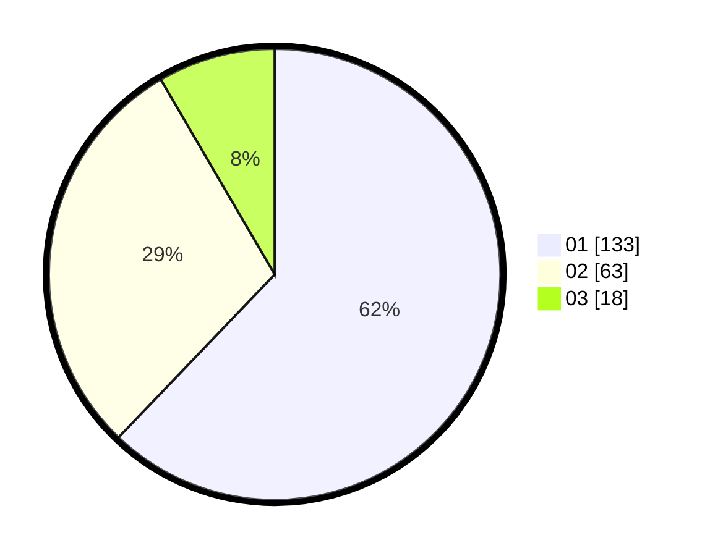

# Hasil

Hasil perolehan suara paslon dapat dilihat pada file paslon-01.txt, paslon-02.txt, dan paslon-03.txt.

Jika tidak ada, artinya data tersebut belum ada pada SIREKAP.

## Perolehan Suara

 * Paslon 01: **133**.
 * Paslon 02: **63**.
 * Paslon 03: **18**.

## Foto C Plano

https://sirekap-obj-formc.kpu.go.id/17f3/pemilu/ppwp/31/71/03/10/08/3171031008073-20240214-185743--e33f40c1-0988-43f4-abab-3c22f1fc2987.jpg

https://sirekap-obj-formc.kpu.go.id/17f3/pemilu/ppwp/31/71/03/10/08/3171031008073-20240214-190213--9cdb62f4-a7a3-4768-91de-15c77248ac86.jpg

https://sirekap-obj-formc.kpu.go.id/17f3/pemilu/ppwp/31/71/03/10/08/3171031008073-20240214-190051--2aee2892-9c89-4a8e-81a6-86c2e1395cda.jpg

## DATA PEMILIH TETAP

Jumlah pemilih dalam DPT: **275**.
 * L: **127**.
 * P: **148**.

## DATA PENGGUNA HAK PILIH

Jumlah pengguna hak pilih dalam DPT: **215**.
 * L: **101**.
 * P: **114**.

Jumlah pengguna hak pilih dalam DPTb: **1**.
 * L: **0**.
 * P: **1**.

Jumlah pengguna hak pilih dalam DPK: **2**.
 * L: **1**.
 * P: **1**.

Jumlah pengguna hak pilih: **218**.
 * L: **102**.
 * P: **116**.

## JUMLAH SUARA SAH DAN TIDAK SAH

JUMLAH SELURUH SUARA SAH: **214**.

JUMLAH SUARA TIDAK SAH: **4**.

JUMLAH SELURUH SUARA SAH DAN SUARA TIDAK SAH: **218**.
