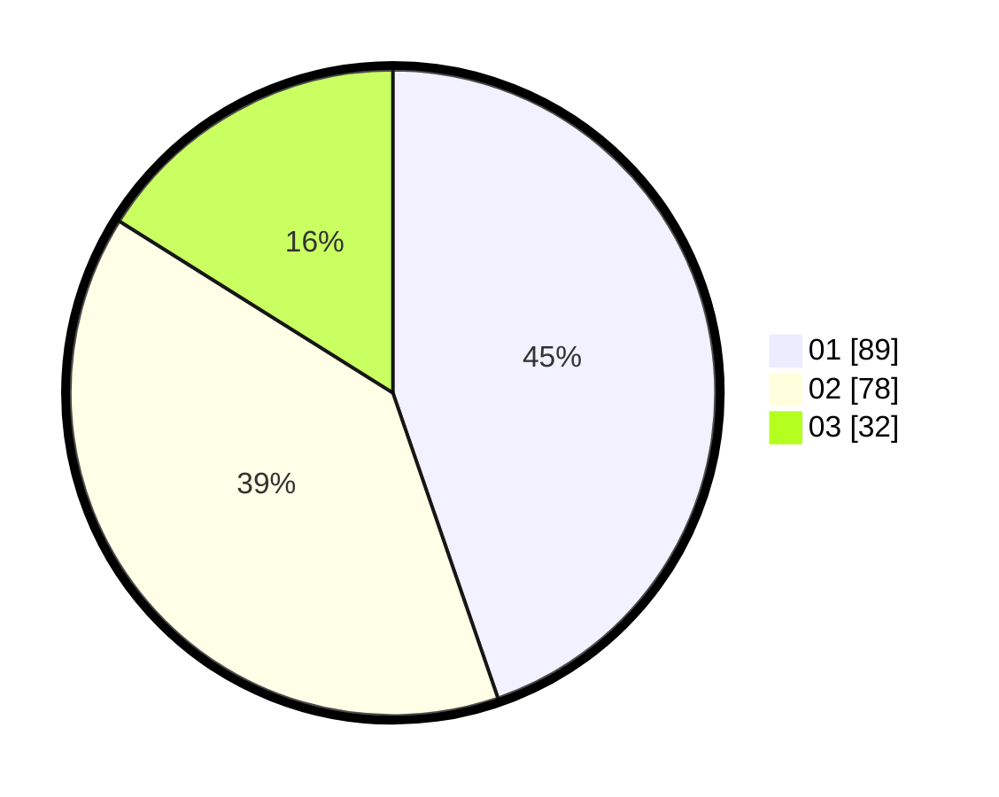

# Hasil

Hasil perolehan suara paslon dapat dilihat pada file paslon-01.txt, paslon-02.txt, dan paslon-03.txt.

Jika tidak ada, artinya data tersebut belum ada pada SIREKAP.

## Perolehan Suara

 * Paslon 01: **89**.
 * Paslon 02: **78**.
 * Paslon 03: **32**.

## Foto C Plano

https://sirekap-obj-formc.kpu.go.id/a3fe/pemilu/ppwp/31/71/03/10/08/3171031008074-20240216-080452--a786579d-847f-43e2-98e7-5eaac6af72fe.jpg

https://sirekap-obj-formc.kpu.go.id/a3fe/pemilu/ppwp/31/71/03/10/08/3171031008074-20240216-080456--d0b42bdd-10db-4d61-86c9-f4e55f1bde03.jpg

https://sirekap-obj-formc.kpu.go.id/a3fe/pemilu/ppwp/31/71/03/10/08/3171031008074-20240216-080454--eee71849-b578-4d20-b1c7-691df0d1c86f.jpg

## DATA PEMILIH TETAP

Jumlah pemilih dalam DPT: **274**.
 * L: **141**.
 * P: **133**.

## DATA PENGGUNA HAK PILIH

Jumlah pengguna hak pilih dalam DPT: **199**.
 * L: **98**.
 * P: **101**.

Jumlah pengguna hak pilih dalam DPTb: **0**.
 * L: **0**.
 * P: **0**.

Jumlah pengguna hak pilih dalam DPK: **0**.
 * L: **0**.
 * P: **0**.

Jumlah pengguna hak pilih: **0**.
 * L: **0**.
 * P: **0**.

## JUMLAH SUARA SAH DAN TIDAK SAH

JUMLAH SELURUH SUARA SAH: **199**.

JUMLAH SUARA TIDAK SAH: **5**.

JUMLAH SELURUH SUARA SAH DAN SUARA TIDAK SAH: **204**.
