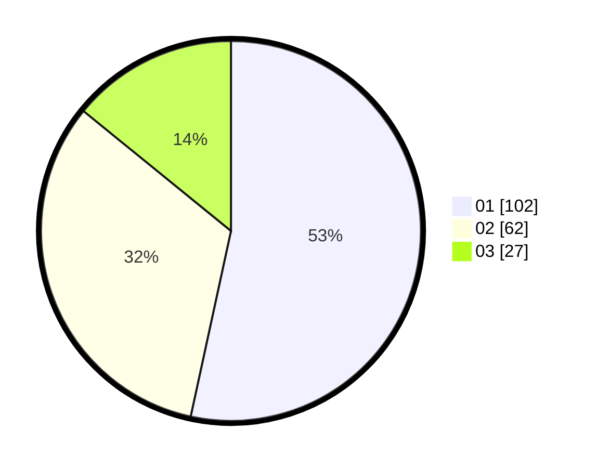

# Hasil

Hasil perolehan suara paslon dapat dilihat pada file paslon-01.txt, paslon-02.txt, dan paslon-03.txt.

Jika tidak ada, artinya data tersebut belum ada pada SIREKAP.

## Perolehan Suara

 * Paslon 01: **102**.
 * Paslon 02: **62**.
 * Paslon 03: **27**.

## Foto C Plano

https://sirekap-obj-formc.kpu.go.id/c897/pemilu/ppwp/31/71/03/10/08/3171031008076-20240215-211547--0bdc12b2-b783-41c2-841d-60a4b34053d7.jpg

https://sirekap-obj-formc.kpu.go.id/c897/pemilu/ppwp/31/71/03/10/08/3171031008076-20240215-211549--a2353aad-9cfa-4efd-9aed-00d843e83ba1.jpg

https://sirekap-obj-formc.kpu.go.id/c897/pemilu/ppwp/31/71/03/10/08/3171031008076-20240215-211548--4aa2fe6d-d53a-4106-9541-519abad0d6c2.jpg

## DATA PEMILIH TETAP

Jumlah pemilih dalam DPT: **274**.
 * L: **136**.
 * P: **138**.

## DATA PENGGUNA HAK PILIH

Jumlah pengguna hak pilih dalam DPT: **191**.
 * L: **93**.
 * P: **98**.

Jumlah pengguna hak pilih dalam DPTb: **0**.
 * L: **0**.
 * P: **0**.

Jumlah pengguna hak pilih dalam DPK: **1**.
 * L: **0**.
 * P: **1**.

Jumlah pengguna hak pilih: **192**.
 * L: **93**.
 * P: **99**.

## JUMLAH SUARA SAH DAN TIDAK SAH

JUMLAH SELURUH SUARA SAH: **191**.

JUMLAH SUARA TIDAK SAH: **1**.

JUMLAH SELURUH SUARA SAH DAN SUARA TIDAK SAH: **192**.
