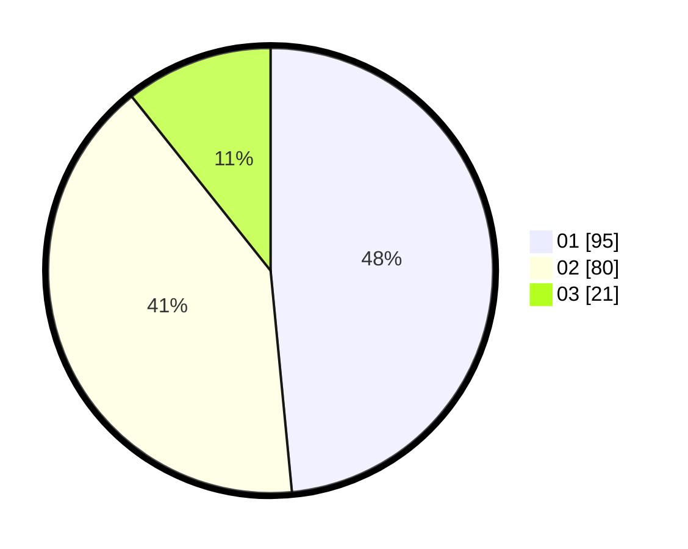

# Hasil

Hasil perolehan suara paslon dapat dilihat pada file paslon-01.txt, paslon-02.txt, dan paslon-03.txt.

Jika tidak ada, artinya data tersebut belum ada pada SIREKAP.

## Perolehan Suara

 * Paslon 01: **95**.
 * Paslon 02: **80**.
 * Paslon 03: **21**.

## Foto C Plano

https://sirekap-obj-formc.kpu.go.id/77f2/pemilu/ppwp/31/71/03/10/08/3171031008079-20240216-151608--63135e14-0c70-4676-8cc7-b3067052d7cc.jpg

https://sirekap-obj-formc.kpu.go.id/77f2/pemilu/ppwp/31/71/03/10/08/3171031008079-20240216-151609--107ae1f1-237b-459b-8aaa-5455ebcf24c4.jpg

https://sirekap-obj-formc.kpu.go.id/77f2/pemilu/ppwp/31/71/03/10/08/3171031008079-20240216-151608--39908660-cec1-4fca-a711-df59d1390a3a.jpg

## DATA PEMILIH TETAP

Jumlah pemilih dalam DPT: **265**.
 * L: **137**.
 * P: **128**.

## DATA PENGGUNA HAK PILIH

Jumlah pengguna hak pilih dalam DPT: **193**.
 * L: **94**.
 * P: **99**.

Jumlah pengguna hak pilih dalam DPTb: **0**.
 * L: **0**.
 * P: **0**.

Jumlah pengguna hak pilih dalam DPK: **5**.
 * L: **2**.
 * P: **3**.

Jumlah pengguna hak pilih: **198**.
 * L: **96**.
 * P: **102**.

## JUMLAH SUARA SAH DAN TIDAK SAH

JUMLAH SELURUH SUARA SAH: **196**.

JUMLAH SUARA TIDAK SAH: **2**.

JUMLAH SELURUH SUARA SAH DAN SUARA TIDAK SAH: **198**.
