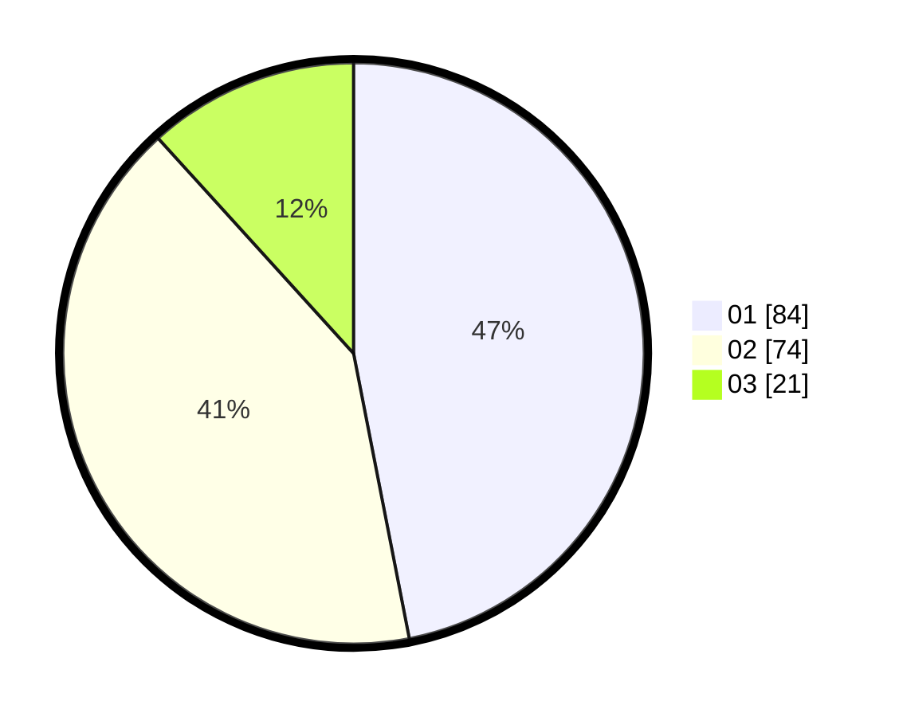

# Hasil

Hasil perolehan suara paslon dapat dilihat pada file paslon-01.txt, paslon-02.txt, dan paslon-03.txt.

Jika tidak ada, artinya data tersebut belum ada pada SIREKAP.

## Perolehan Suara

 * Paslon 01: **84**.
 * Paslon 02: **74**.
 * Paslon 03: **21**.

## Foto C Plano

https://sirekap-obj-formc.kpu.go.id/4322/pemilu/ppwp/31/71/03/10/08/3171031008080-20240216-002131--c0acb7b5-05d7-41e1-b8ac-2e11e7e35c8c.jpg

https://sirekap-obj-formc.kpu.go.id/4322/pemilu/ppwp/31/71/03/10/08/3171031008080-20240216-002133--28f5b0b1-8d79-475a-9d71-bbb10690cb1c.jpg

https://sirekap-obj-formc.kpu.go.id/4322/pemilu/ppwp/31/71/03/10/08/3171031008080-20240216-002132--4352e154-9cf6-4daf-8ef0-17f5a987180a.jpg

## DATA PEMILIH TETAP

Jumlah pemilih dalam DPT: **286**.
 * L: **146**.
 * P: **140**.

## DATA PENGGUNA HAK PILIH

Jumlah pengguna hak pilih dalam DPT: **179**.
 * L: **84**.
 * P: **95**.

Jumlah pengguna hak pilih dalam DPTb: **0**.
 * L: **0**.
 * P: **0**.

Jumlah pengguna hak pilih dalam DPK: **2**.
 * L: **2**.
 * P: **0**.

Jumlah pengguna hak pilih: **181**.
 * L: **86**.
 * P: **95**.

## JUMLAH SUARA SAH DAN TIDAK SAH

JUMLAH SELURUH SUARA SAH: **179**.

JUMLAH SUARA TIDAK SAH: **2**.

JUMLAH SELURUH SUARA SAH DAN SUARA TIDAK SAH: **181**.
