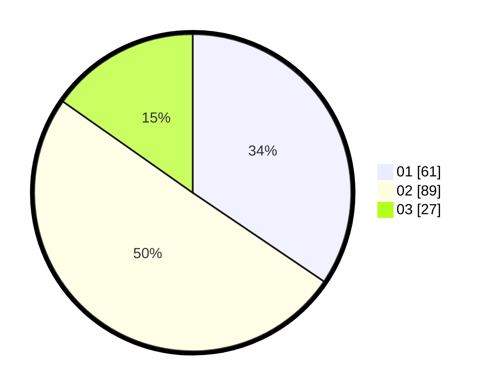

# Hasil

Hasil perolehan suara paslon dapat dilihat pada file paslon-01.txt, paslon-02.txt, dan paslon-03.txt.

Jika tidak ada, artinya data tersebut belum ada pada SIREKAP.

## Perolehan Suara

 * Paslon 01: **61**.
 * Paslon 02: **89**.
 * Paslon 03: **27**.

## Foto C Plano

https://sirekap-obj-formc.kpu.go.id/c3c8/pemilu/ppwp/31/71/03/10/08/3171031008083-20240214-200031--66f44726-2479-4b4d-b660-a699a9df67d7.jpg

https://sirekap-obj-formc.kpu.go.id/c3c8/pemilu/ppwp/31/71/03/10/08/3171031008083-20240214-195015--d4ef9fc6-398f-45b6-91a5-646cde2fcd36.jpg

https://sirekap-obj-formc.kpu.go.id/c3c8/pemilu/ppwp/31/71/03/10/08/3171031008083-20240215-215123--f6bdbc56-4916-4cc6-8af0-9e5b9185fcf3.jpg

## DATA PEMILIH TETAP

Jumlah pemilih dalam DPT: **286**.
 * L: **152**.
 * P: **134**.

## DATA PENGGUNA HAK PILIH

Jumlah pengguna hak pilih dalam DPT: **181**.
 * L: **97**.
 * P: **84**.

Jumlah pengguna hak pilih dalam DPTb: **0**.
 * L: **0**.
 * P: **0**.

Jumlah pengguna hak pilih dalam DPK: **0**.
 * L: **0**.
 * P: **0**.

Jumlah pengguna hak pilih: **181**.
 * L: **97**.
 * P: **84**.

## JUMLAH SUARA SAH DAN TIDAK SAH

JUMLAH SELURUH SUARA SAH: **177**.

JUMLAH SUARA TIDAK SAH: **4**.

JUMLAH SELURUH SUARA SAH DAN SUARA TIDAK SAH: **181**.
