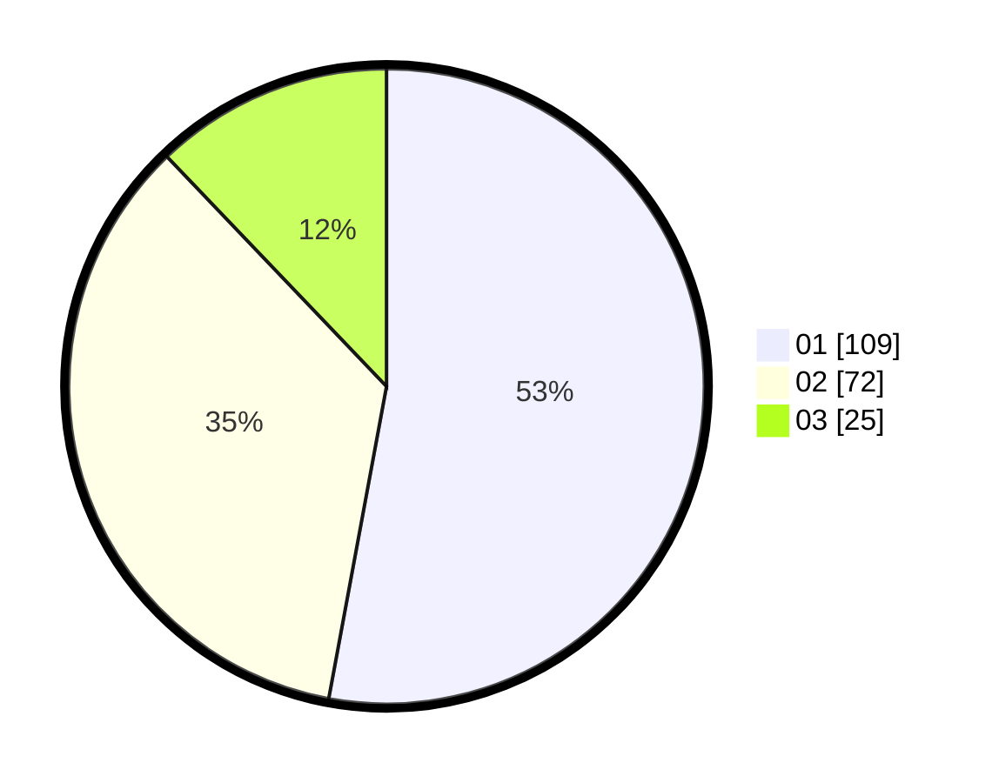

# Hasil

Hasil perolehan suara paslon dapat dilihat pada file paslon-01.txt, paslon-02.txt, dan paslon-03.txt.

Jika tidak ada, artinya data tersebut belum ada pada SIREKAP.

## Perolehan Suara

 * Paslon 01: **109**.
 * Paslon 02: **72**.
 * Paslon 03: **25**.

## Foto C Plano

https://sirekap-obj-formc.kpu.go.id/c08f/pemilu/ppwp/31/71/03/10/08/3171031008088-20240215-025749--b1242235-1c8f-4d0c-8423-15b15a6ccdc7.jpg

https://sirekap-obj-formc.kpu.go.id/c08f/pemilu/ppwp/31/71/03/10/08/3171031008088-20240215-025811--dcff7029-6c89-47ae-9db9-de233eff4da6.jpg

https://sirekap-obj-formc.kpu.go.id/c08f/pemilu/ppwp/31/71/03/10/08/3171031008088-20240215-025800--c5167b2e-db76-4980-a6bf-f7486506edc6.jpg

## DATA PEMILIH TETAP

Jumlah pemilih dalam DPT: **266**.
 * L: **117**.
 * P: **149**.

## DATA PENGGUNA HAK PILIH

Jumlah pengguna hak pilih dalam DPT: **199**.
 * L: **84**.
 * P: **115**.

Jumlah pengguna hak pilih dalam DPTb: **1**.
 * L: **0**.
 * P: **1**.

Jumlah pengguna hak pilih dalam DPK: **11**.
 * L: **6**.
 * P: **5**.

Jumlah pengguna hak pilih: **211**.
 * L: **90**.
 * P: **121**.

## JUMLAH SUARA SAH DAN TIDAK SAH

JUMLAH SELURUH SUARA SAH: **206**.

JUMLAH SUARA TIDAK SAH: **5**.

JUMLAH SELURUH SUARA SAH DAN SUARA TIDAK SAH: **211**.
