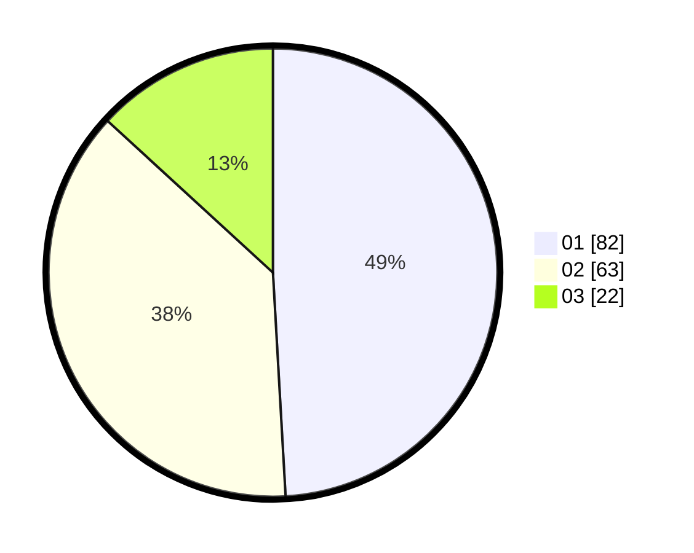

# Hasil

Hasil perolehan suara paslon dapat dilihat pada file paslon-01.txt, paslon-02.txt, dan paslon-03.txt.

Jika tidak ada, artinya data tersebut belum ada pada SIREKAP.

## Perolehan Suara

 * Paslon 01: **82**.
 * Paslon 02: **63**.
 * Paslon 03: **22**.

## Foto C Plano

https://sirekap-obj-formc.kpu.go.id/fbc8/pemilu/ppwp/31/71/03/10/08/3171031008089-20240216-023427--cd4d6774-a319-4460-8b3f-4f88f060561d.jpg

https://sirekap-obj-formc.kpu.go.id/fbc8/pemilu/ppwp/31/71/03/10/08/3171031008089-20240216-023429--9aebbc0c-918f-4d3e-90d8-0f9d05a4d82d.jpg

https://sirekap-obj-formc.kpu.go.id/fbc8/pemilu/ppwp/31/71/03/10/08/3171031008089-20240216-023428--8a103246-2104-4b10-8f1a-c52d915c1502.jpg

## DATA PEMILIH TETAP

Jumlah pemilih dalam DPT: **260**.
 * L: **142**.
 * P: **118**.

## DATA PENGGUNA HAK PILIH

Jumlah pengguna hak pilih dalam DPT: **169**.
 * L: **84**.
 * P: **85**.

Jumlah pengguna hak pilih dalam DPTb: **0**.
 * L: **0**.
 * P: **0**.

Jumlah pengguna hak pilih dalam DPK: **1**.
 * L: **1**.
 * P: **0**.

Jumlah pengguna hak pilih: **170**.
 * L: **85**.
 * P: **85**.

## JUMLAH SUARA SAH DAN TIDAK SAH

JUMLAH SELURUH SUARA SAH: **167**.

JUMLAH SUARA TIDAK SAH: **3**.

JUMLAH SELURUH SUARA SAH DAN SUARA TIDAK SAH: **170**.
