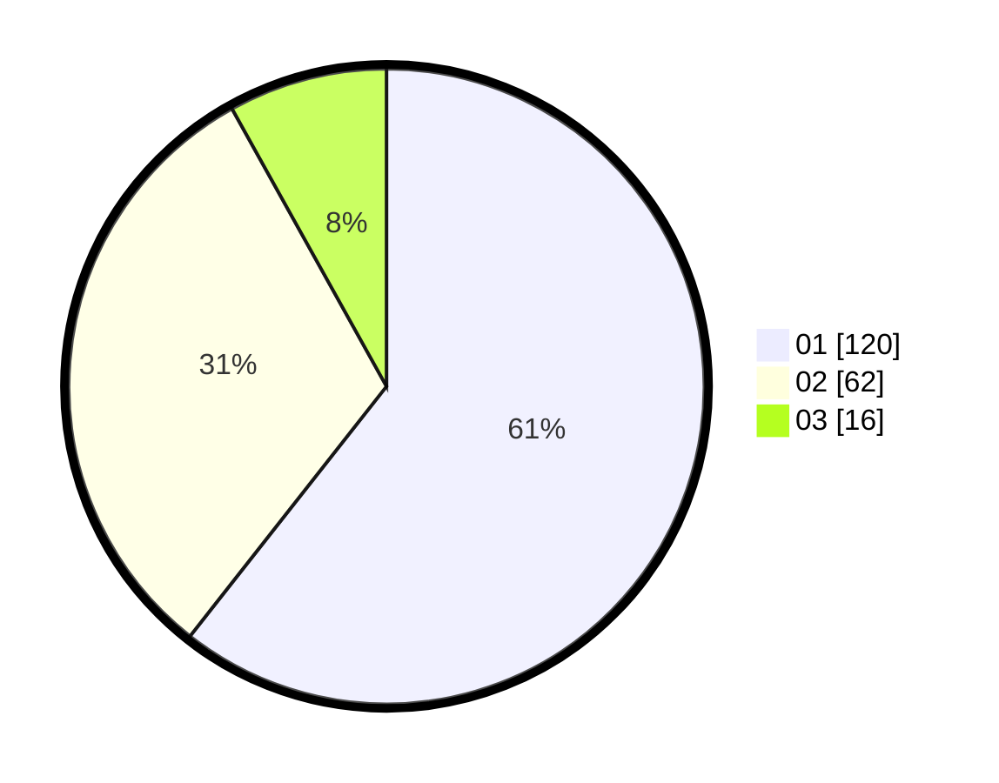

# Hasil

Hasil perolehan suara paslon dapat dilihat pada file paslon-01.txt, paslon-02.txt, dan paslon-03.txt.

Jika tidak ada, artinya data tersebut belum ada pada SIREKAP.

## Perolehan Suara

 * Paslon 01: **120**.
 * Paslon 02: **62**.
 * Paslon 03: **16**.

## Foto C Plano

https://sirekap-obj-formc.kpu.go.id/e895/pemilu/ppwp/31/71/03/10/08/3171031008090-20240214-183856--9a8601fd-c7dd-4085-9108-ac1eceaef4b9.jpg

https://sirekap-obj-formc.kpu.go.id/e895/pemilu/ppwp/31/71/03/10/08/3171031008090-20240214-183918--ab0615c1-a10d-4c9f-952b-948e633834cc.jpg

https://sirekap-obj-formc.kpu.go.id/e895/pemilu/ppwp/31/71/03/10/08/3171031008090-20240214-183907--24484f7b-07d6-4bbd-a460-7ab981626694.jpg

## DATA PEMILIH TETAP

Jumlah pemilih dalam DPT: **255**.
 * L: **130**.
 * P: **125**.

## DATA PENGGUNA HAK PILIH

Jumlah pengguna hak pilih dalam DPT: **195**.
 * L: **100**.
 * P: **95**.

Jumlah pengguna hak pilih dalam DPTb: **2**.
 * L: **0**.
 * P: **2**.

Jumlah pengguna hak pilih dalam DPK: **2**.
 * L: **1**.
 * P: **1**.

Jumlah pengguna hak pilih: **199**.
 * L: **101**.
 * P: **98**.

## JUMLAH SUARA SAH DAN TIDAK SAH

JUMLAH SELURUH SUARA SAH: **198**.

JUMLAH SUARA TIDAK SAH: **1**.

JUMLAH SELURUH SUARA SAH DAN SUARA TIDAK SAH: **199**.
