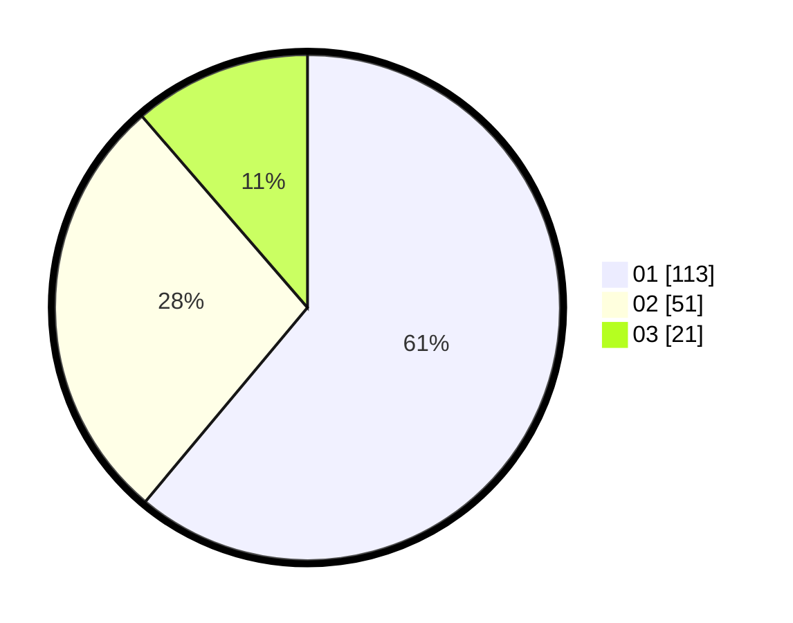

# Hasil

Hasil perolehan suara paslon dapat dilihat pada file paslon-01.txt, paslon-02.txt, dan paslon-03.txt.

Jika tidak ada, artinya data tersebut belum ada pada SIREKAP.

## Perolehan Suara

 * Paslon 01: **113**.
 * Paslon 02: **51**.
 * Paslon 03: **21**.

## Foto C Plano

https://sirekap-obj-formc.kpu.go.id/27f5/pemilu/ppwp/31/71/03/10/08/3171031008091-20240215-225547--8d4d2704-fcce-4845-a15c-78430a5ea9c1.jpg

https://sirekap-obj-formc.kpu.go.id/27f5/pemilu/ppwp/31/71/03/10/08/3171031008091-20240215-225551--bbd952a0-d285-4c41-b88d-b4bf13aeed80.jpg

https://sirekap-obj-formc.kpu.go.id/27f5/pemilu/ppwp/31/71/03/10/08/3171031008091-20240215-225549--bc79ed72-d7e5-463c-bdcc-e28cd4b0419d.jpg

## DATA PEMILIH TETAP

Jumlah pemilih dalam DPT: **0**.
 * L: **0**.
 * P: **0**.

## DATA PENGGUNA HAK PILIH

Jumlah pengguna hak pilih dalam DPT: **0**.
 * L: **0**.
 * P: **0**.

Jumlah pengguna hak pilih dalam DPTb: **0**.
 * L: **0**.
 * P: **0**.

Jumlah pengguna hak pilih dalam DPK: **0**.
 * L: **0**.
 * P: **0**.

Jumlah pengguna hak pilih: **0**.
 * L: **0**.
 * P: **0**.

## JUMLAH SUARA SAH DAN TIDAK SAH

JUMLAH SELURUH SUARA SAH: **185**.

JUMLAH SUARA TIDAK SAH: **1**.

JUMLAH SELURUH SUARA SAH DAN SUARA TIDAK SAH: **186**.
