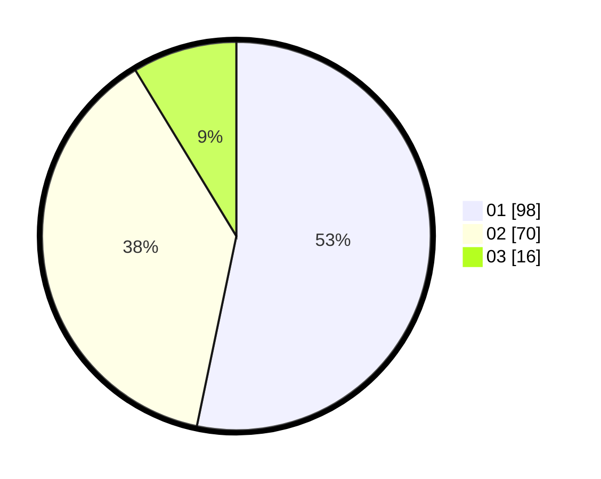

# Hasil

Hasil perolehan suara paslon dapat dilihat pada file paslon-01.txt, paslon-02.txt, dan paslon-03.txt.

Jika tidak ada, artinya data tersebut belum ada pada SIREKAP.

## Perolehan Suara

 * Paslon 01: **98**.
 * Paslon 02: **70**.
 * Paslon 03: **16**.

## Foto C Plano

https://sirekap-obj-formc.kpu.go.id/eeea/pemilu/ppwp/31/71/03/10/08/3171031008092-20240215-014021--085c16bf-1226-43e3-9658-40117f81379b.jpg

https://sirekap-obj-formc.kpu.go.id/eeea/pemilu/ppwp/31/71/03/10/08/3171031008092-20240215-014042--564a0a19-5d76-4d57-a3a0-d15eeda67dfd.jpg

https://sirekap-obj-formc.kpu.go.id/eeea/pemilu/ppwp/31/71/03/10/08/3171031008092-20240215-014032--86dd26f8-f68f-465f-953b-4c7b5a887478.jpg

## DATA PEMILIH TETAP

Jumlah pemilih dalam DPT: **270**.
 * L: **147**.
 * P: **123**.

## DATA PENGGUNA HAK PILIH

Jumlah pengguna hak pilih dalam DPT: **182**.
 * L: **100**.
 * P: **82**.

Jumlah pengguna hak pilih dalam DPTb: **3**.
 * L: **1**.
 * P: **2**.

Jumlah pengguna hak pilih dalam DPK: **1**.
 * L: **0**.
 * P: **1**.

Jumlah pengguna hak pilih: **186**.
 * L: **101**.
 * P: **85**.

## JUMLAH SUARA SAH DAN TIDAK SAH

JUMLAH SELURUH SUARA SAH: **184**.

JUMLAH SUARA TIDAK SAH: **2**.

JUMLAH SELURUH SUARA SAH DAN SUARA TIDAK SAH: **186**.
