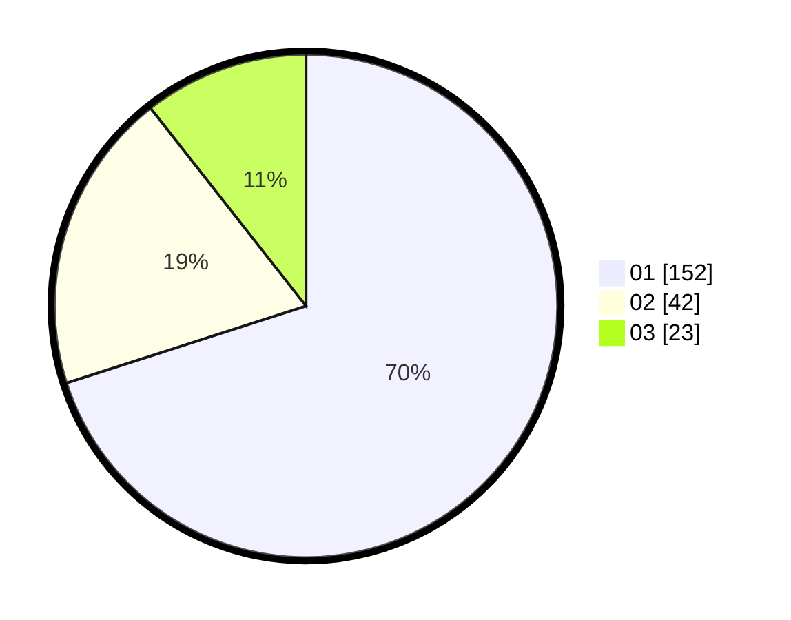

# Hasil

Hasil perolehan suara paslon dapat dilihat pada file paslon-01.txt, paslon-02.txt, dan paslon-03.txt.

Jika tidak ada, artinya data tersebut belum ada pada SIREKAP.

## Perolehan Suara

 * Paslon 01: **152**.
 * Paslon 02: **42**.
 * Paslon 03: **23**.

## Foto C Plano

https://sirekap-obj-formc.kpu.go.id/a861/pemilu/ppwp/31/71/03/10/08/3171031008093-20240215-213312--1d746ab0-d163-487c-bedf-22b5aeb52379.jpg

https://sirekap-obj-formc.kpu.go.id/a861/pemilu/ppwp/31/71/03/10/08/3171031008093-20240214-205310--2b3923fb-30c9-4745-914b-75bae53946db.jpg

https://sirekap-obj-formc.kpu.go.id/a861/pemilu/ppwp/31/71/03/10/08/3171031008093-20240214-205005--fe301b09-ba84-4bac-8031-106c1e03723d.jpg

## DATA PEMILIH TETAP

Jumlah pemilih dalam DPT: **276**.
 * L: **144**.
 * P: **132**.

## DATA PENGGUNA HAK PILIH

Jumlah pengguna hak pilih dalam DPT: **213**.
 * L: **108**.
 * P: **105**.

Jumlah pengguna hak pilih dalam DPTb: **3**.
 * L: **1**.
 * P: **2**.

Jumlah pengguna hak pilih dalam DPK: **1**.
 * L: **0**.
 * P: **1**.

Jumlah pengguna hak pilih: **217**.
 * L: **109**.
 * P: **108**.

## JUMLAH SUARA SAH DAN TIDAK SAH

JUMLAH SELURUH SUARA SAH: **217**.

JUMLAH SUARA TIDAK SAH: **0**.

JUMLAH SELURUH SUARA SAH DAN SUARA TIDAK SAH: **217**.
