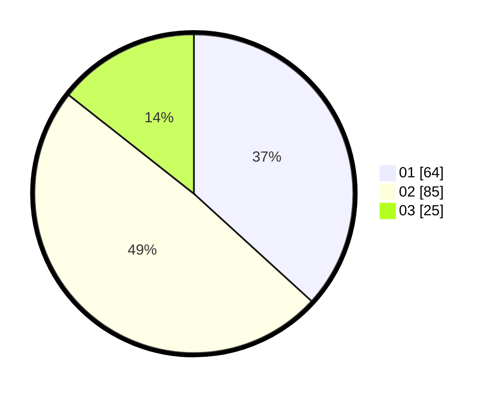

# Hasil

Hasil perolehan suara paslon dapat dilihat pada file paslon-01.txt, paslon-02.txt, dan paslon-03.txt.

Jika tidak ada, artinya data tersebut belum ada pada SIREKAP.

## Perolehan Suara

 * Paslon 01: **64**.
 * Paslon 02: **85**.
 * Paslon 03: **25**.

## Foto C Plano

https://sirekap-obj-formc.kpu.go.id/cf16/pemilu/ppwp/31/71/03/10/08/3171031008097-20240215-005855--abed6b6f-faba-4efc-873f-a23fc6e669c5.jpg

https://sirekap-obj-formc.kpu.go.id/cf16/pemilu/ppwp/31/71/03/10/08/3171031008097-20240215-012620--60a33834-9e33-4fe6-8a34-9166d395fedf.jpg
