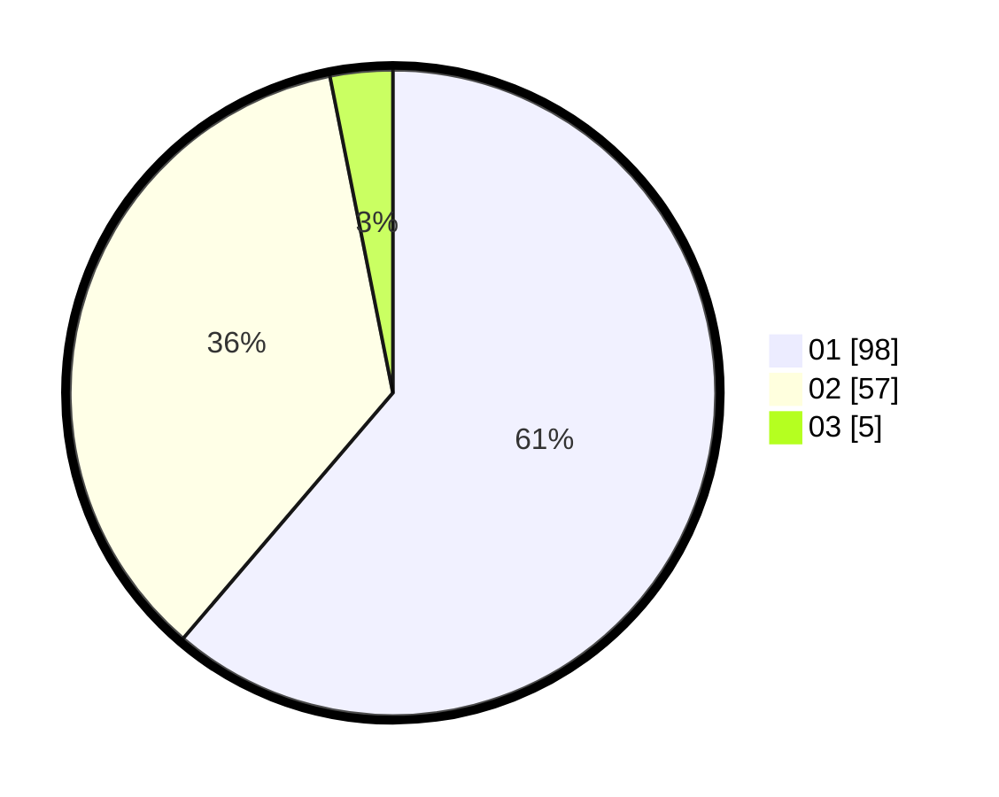

# Hasil

Hasil perolehan suara paslon dapat dilihat pada file paslon-01.txt, paslon-02.txt, dan paslon-03.txt.

Jika tidak ada, artinya data tersebut belum ada pada SIREKAP.

## Perolehan Suara

 * Paslon 01: **98**.
 * Paslon 02: **57**.
 * Paslon 03: **5**.

## Foto C Plano

https://sirekap-obj-formc.kpu.go.id/c642/pemilu/ppwp/31/71/03/10/08/3171031008100-20240214-215701--b385c144-4870-4b9d-bada-95575ff7c57d.jpg

https://sirekap-obj-formc.kpu.go.id/c642/pemilu/ppwp/31/71/03/10/08/3171031008100-20240214-221009--14ed171f-c85e-434f-89c0-881f1f7429ad.jpg

https://sirekap-obj-formc.kpu.go.id/c642/pemilu/ppwp/31/71/03/10/08/3171031008100-20240214-221118--6d0e984d-f9a2-4807-a3f6-4e0a33d44bf6.jpg
