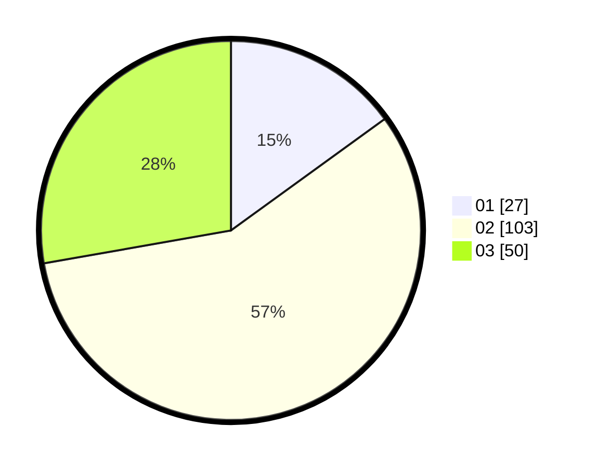

# Hasil

Hasil perolehan suara paslon dapat dilihat pada file paslon-01.txt, paslon-02.txt, dan paslon-03.txt.

Jika tidak ada, artinya data tersebut belum ada pada SIREKAP.

## Perolehan Suara

 * Paslon 01: **27**.
 * Paslon 02: **103**.
 * Paslon 03: **50**.

## Foto C Plano

https://sirekap-obj-formc.kpu.go.id/802b/pemilu/ppwp/31/71/04/10/01/3171041001002-20240216-192813--c3f90941-c693-47d7-906a-ce80f682a7d3.jpg

https://sirekap-obj-formc.kpu.go.id/802b/pemilu/ppwp/31/71/04/10/01/3171041001002-20240216-192814--e64e5efb-cb20-496e-b0c5-9f7f15987114.jpg

https://sirekap-obj-formc.kpu.go.id/802b/pemilu/ppwp/31/71/04/10/01/3171041001002-20240216-192814--f0ecc162-d223-456b-8cec-0164fbe0da24.jpg

## DATA PEMILIH TETAP

Jumlah pemilih dalam DPT: **238**.
 * L: **111**.
 * P: **126**.

## DATA PENGGUNA HAK PILIH

Jumlah pengguna hak pilih dalam DPT: **171**.
 * L: **70**.
 * P: **101**.

Jumlah pengguna hak pilih dalam DPTb: **11**.
 * L: **4**.
 * P: **7**.

Jumlah pengguna hak pilih dalam DPK: **0**.
 * L: **0**.
 * P: **0**.

Jumlah pengguna hak pilih: **182**.
 * L: **74**.
 * P: **108**.

## JUMLAH SUARA SAH DAN TIDAK SAH

JUMLAH SELURUH SUARA SAH: **180**.

JUMLAH SUARA TIDAK SAH: **2**.

JUMLAH SELURUH SUARA SAH DAN SUARA TIDAK SAH: **182**.
