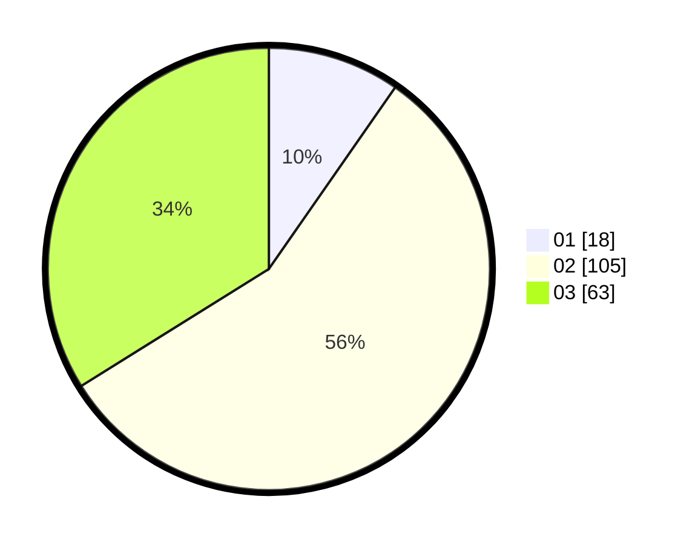

# Hasil

Hasil perolehan suara paslon dapat dilihat pada file paslon-01.txt, paslon-02.txt, dan paslon-03.txt.

Jika tidak ada, artinya data tersebut belum ada pada SIREKAP.

## Perolehan Suara

 * Paslon 01: **18**.
 * Paslon 02: **105**.
 * Paslon 03: **63**.

## Foto C Plano

https://sirekap-obj-formc.kpu.go.id/3232/pemilu/ppwp/31/71/04/10/01/3171041001004-20240217-011327--60292646-a1eb-4388-98d3-7bc71ce89abe.jpg

https://sirekap-obj-formc.kpu.go.id/3232/pemilu/ppwp/31/71/04/10/01/3171041001004-20240217-011328--9776614c-1c74-4ad1-96d9-a76c7844ea4c.jpg

https://sirekap-obj-formc.kpu.go.id/3232/pemilu/ppwp/31/71/04/10/01/3171041001004-20240217-011328--6d91cc83-04ce-4acf-b0ca-05988a328e50.jpg

## DATA PEMILIH TETAP

Jumlah pemilih dalam DPT: **270**.
 * L: **13**.
 * P: **131**.

## DATA PENGGUNA HAK PILIH

Jumlah pengguna hak pilih dalam DPT: **160**.
 * L: **83**.
 * P: **77**.

Jumlah pengguna hak pilih dalam DPTb: **22**.
 * L: **10**.
 * P: **12**.

Jumlah pengguna hak pilih dalam DPK: **6**.
 * L: **2**.
 * P: **4**.

Jumlah pengguna hak pilih: **188**.
 * L: **95**.
 * P: **93**.

## JUMLAH SUARA SAH DAN TIDAK SAH

JUMLAH SELURUH SUARA SAH: **186**.

JUMLAH SUARA TIDAK SAH: **2**.

JUMLAH SELURUH SUARA SAH DAN SUARA TIDAK SAH: **188**.
