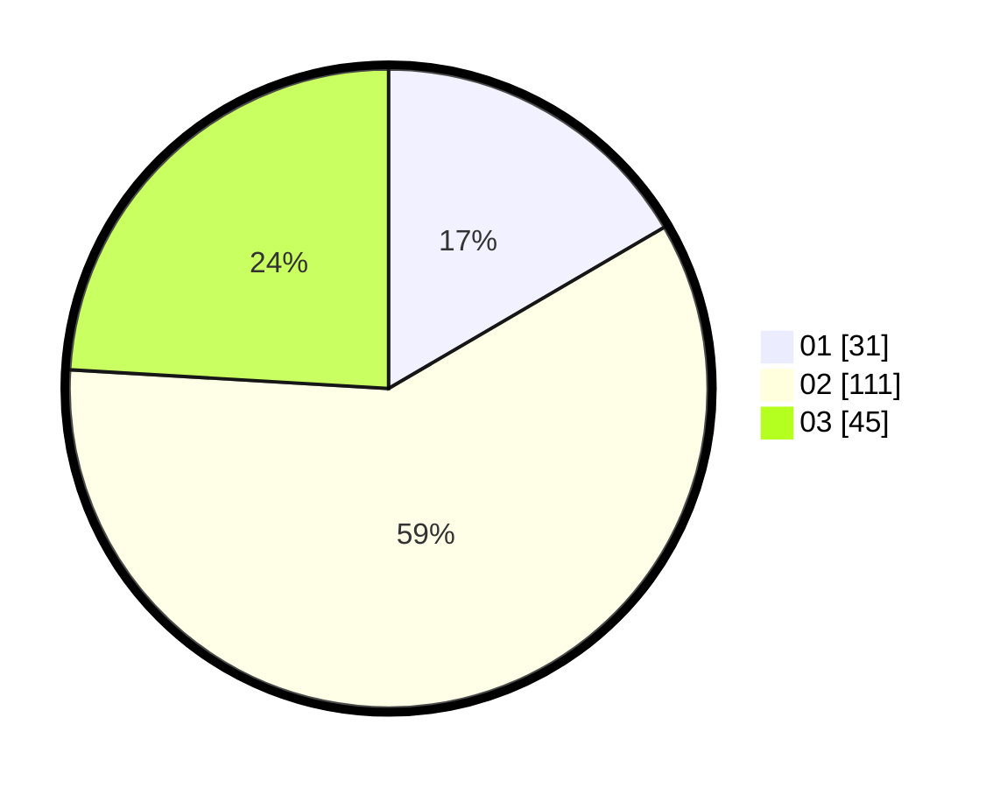

# Hasil

Hasil perolehan suara paslon dapat dilihat pada file paslon-01.txt, paslon-02.txt, dan paslon-03.txt.

Jika tidak ada, artinya data tersebut belum ada pada SIREKAP.

## Perolehan Suara

 * Paslon 01: **31**.
 * Paslon 02: **111**.
 * Paslon 03: **45**.

## Foto C Plano

https://sirekap-obj-formc.kpu.go.id/62a2/pemilu/ppwp/31/71/04/10/01/3171041001009-20240215-211911--b637afef-8fa2-45c0-aeae-aaa79f16a460.jpg

https://sirekap-obj-formc.kpu.go.id/62a2/pemilu/ppwp/31/71/04/10/01/3171041001009-20240215-211913--c2048634-76ad-4b3e-bb8d-d648a89b2d45.jpg

https://sirekap-obj-formc.kpu.go.id/62a2/pemilu/ppwp/31/71/04/10/01/3171041001009-20240215-211912--441e7e11-193b-4bbe-afc6-79e0cf636ee0.jpg

## DATA PEMILIH TETAP

Jumlah pemilih dalam DPT: **270**.
 * L: **135**.
 * P: **135**.

## DATA PENGGUNA HAK PILIH

Jumlah pengguna hak pilih dalam DPT: **188**.
 * L: **92**.
 * P: **96**.

Jumlah pengguna hak pilih dalam DPTb: **2**.
 * L: **1**.
 * P: **1**.

Jumlah pengguna hak pilih dalam DPK: **4**.
 * L: **2**.
 * P: **2**.

Jumlah pengguna hak pilih: **194**.
 * L: **95**.
 * P: **99**.

## JUMLAH SUARA SAH DAN TIDAK SAH

JUMLAH SELURUH SUARA SAH: **187**.

JUMLAH SUARA TIDAK SAH: **7**.

JUMLAH SELURUH SUARA SAH DAN SUARA TIDAK SAH: **194**.
