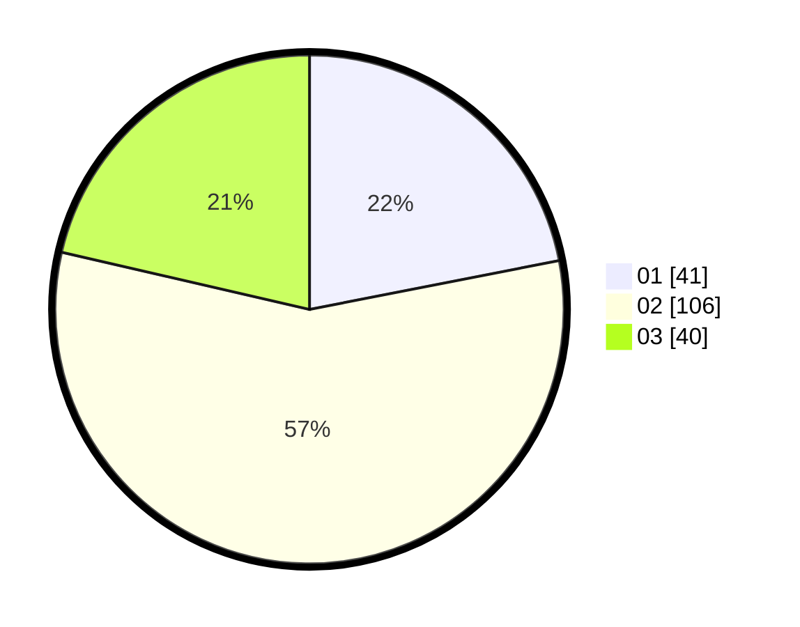

# Hasil

Hasil perolehan suara paslon dapat dilihat pada file paslon-01.txt, paslon-02.txt, dan paslon-03.txt.

Jika tidak ada, artinya data tersebut belum ada pada SIREKAP.

## Perolehan Suara

 * Paslon 01: **41**.
 * Paslon 02: **106**.
 * Paslon 03: **40**.

## Foto C Plano

https://sirekap-obj-formc.kpu.go.id/c340/pemilu/ppwp/31/71/04/10/01/3171041001011-20240216-115426--c69a8037-2e34-478d-88f6-c93e2fce91aa.jpg

https://sirekap-obj-formc.kpu.go.id/c340/pemilu/ppwp/31/71/04/10/01/3171041001011-20240216-115434--212bde94-f0a3-4548-bddc-6c1b26f28719.jpg

https://sirekap-obj-formc.kpu.go.id/c340/pemilu/ppwp/31/71/04/10/01/3171041001011-20240216-115429--54947710-12b7-4771-933b-cc04da12ddac.jpg

## DATA PEMILIH TETAP

Jumlah pemilih dalam DPT: **260**.
 * L: **134**.
 * P: **126**.

## DATA PENGGUNA HAK PILIH

Jumlah pengguna hak pilih dalam DPT: **189**.
 * L: **95**.
 * P: **94**.

Jumlah pengguna hak pilih dalam DPTb: **3**.
 * L: **3**.
 * P: **0**.

Jumlah pengguna hak pilih dalam DPK: **1**.
 * L: **1**.
 * P: **0**.

Jumlah pengguna hak pilih: **193**.
 * L: **99**.
 * P: **94**.

## JUMLAH SUARA SAH DAN TIDAK SAH

JUMLAH SELURUH SUARA SAH: **187**.

JUMLAH SUARA TIDAK SAH: **6**.

JUMLAH SELURUH SUARA SAH DAN SUARA TIDAK SAH: **193**.
