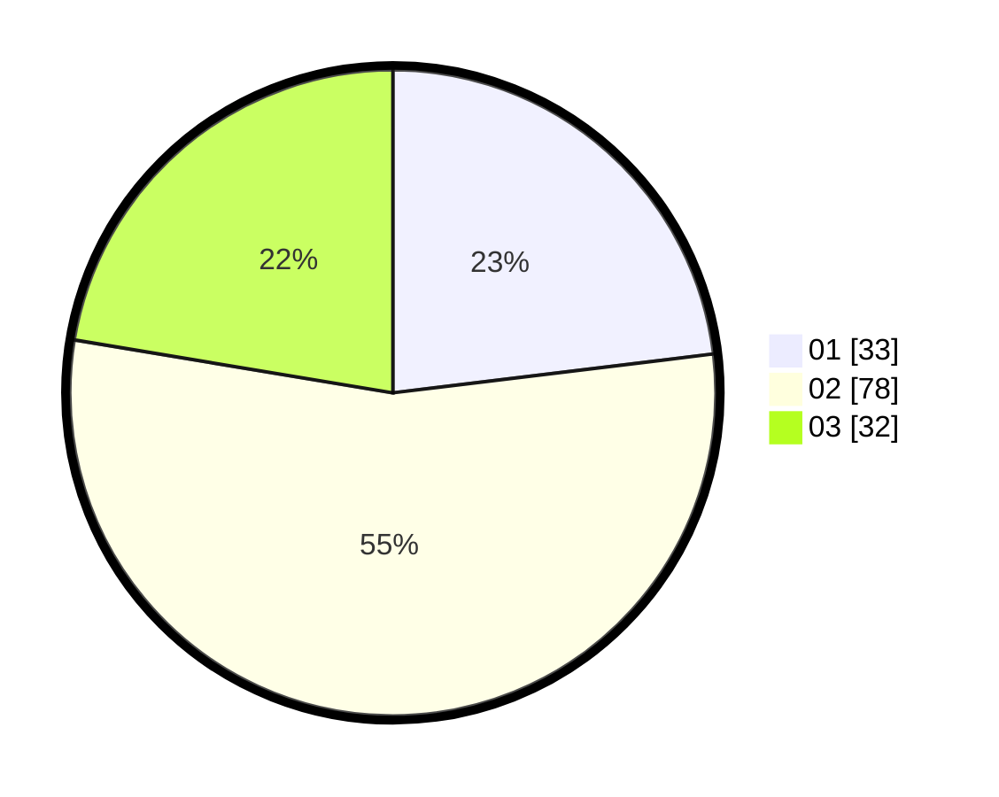

# Hasil

Hasil perolehan suara paslon dapat dilihat pada file paslon-01.txt, paslon-02.txt, dan paslon-03.txt.

Jika tidak ada, artinya data tersebut belum ada pada SIREKAP.

## Perolehan Suara

 * Paslon 01: **33**.
 * Paslon 02: **78**.
 * Paslon 03: **32**.

## Foto C Plano

https://sirekap-obj-formc.kpu.go.id/56a8/pemilu/ppwp/31/71/04/10/01/3171041001013-20240216-215411--caf5a3d2-77d6-4880-b96a-75f626ae140a.jpg

https://sirekap-obj-formc.kpu.go.id/56a8/pemilu/ppwp/31/71/04/10/01/3171041001013-20240216-215412--351ba5e3-5b44-4420-abf6-8de7ec0cc82f.jpg

https://sirekap-obj-formc.kpu.go.id/56a8/pemilu/ppwp/31/71/04/10/01/3171041001013-20240216-215411--23b39611-d973-48d7-82c2-63eed514baf3.jpg

## DATA PEMILIH TETAP

Jumlah pemilih dalam DPT: **257**.
 * L: **140**.
 * P: **117**.

## DATA PENGGUNA HAK PILIH

Jumlah pengguna hak pilih dalam DPT: **140**.
 * L: **73**.
 * P: **67**.

Jumlah pengguna hak pilih dalam DPTb: **2**.
 * L: **1**.
 * P: **1**.

Jumlah pengguna hak pilih dalam DPK: **6**.
 * L: **3**.
 * P: **3**.

Jumlah pengguna hak pilih: **148**.
 * L: **77**.
 * P: **71**.

## JUMLAH SUARA SAH DAN TIDAK SAH

JUMLAH SELURUH SUARA SAH: **143**.

JUMLAH SUARA TIDAK SAH: **5**.

JUMLAH SELURUH SUARA SAH DAN SUARA TIDAK SAH: **148**.
