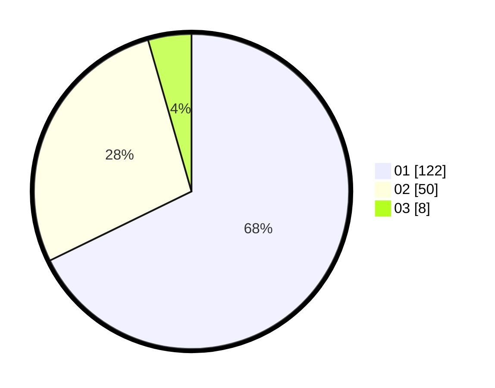

# Hasil

Hasil perolehan suara paslon dapat dilihat pada file paslon-01.txt, paslon-02.txt, dan paslon-03.txt.

Jika tidak ada, artinya data tersebut belum ada pada SIREKAP.

## Perolehan Suara

 * Paslon 01: **122**.
 * Paslon 02: **50**.
 * Paslon 03: **8**.

## Foto C Plano

https://sirekap-obj-formc.kpu.go.id/1fd1/pemilu/ppwp/31/71/04/10/01/3171041001017-20240217-163933--9a6d82fd-e02d-4cb5-a7ec-b1987b807b9e.jpg

https://sirekap-obj-formc.kpu.go.id/1fd1/pemilu/ppwp/31/71/04/10/01/3171041001017-20240217-163934--e864b912-b77e-4dd1-b9be-923f4a815d9d.jpg

https://sirekap-obj-formc.kpu.go.id/1fd1/pemilu/ppwp/31/71/04/10/01/3171041001017-20240217-163934--cc54b4ce-ea19-470c-88ff-10cb587eec99.jpg

## DATA PEMILIH TETAP

Jumlah pemilih dalam DPT: **252**.
 * L: **144**.
 * P: **108**.

## DATA PENGGUNA HAK PILIH

Jumlah pengguna hak pilih dalam DPT: **169**.
 * L: **88**.
 * P: **81**.

Jumlah pengguna hak pilih dalam DPTb: **11**.
 * L: **10**.
 * P: **1**.

Jumlah pengguna hak pilih dalam DPK: **3**.
 * L: **1**.
 * P: **2**.

Jumlah pengguna hak pilih: **183**.
 * L: **99**.
 * P: **84**.

## JUMLAH SUARA SAH DAN TIDAK SAH

JUMLAH SELURUH SUARA SAH: **180**.

JUMLAH SUARA TIDAK SAH: **3**.

JUMLAH SELURUH SUARA SAH DAN SUARA TIDAK SAH: **183**.
