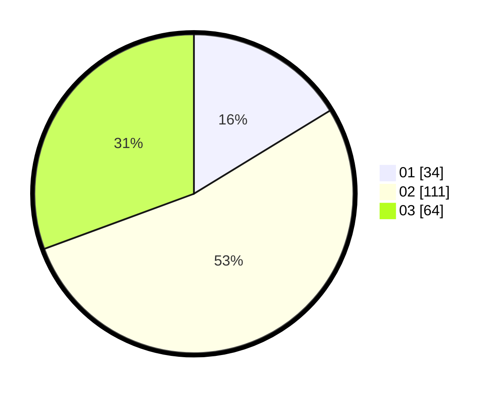

# Hasil

Hasil perolehan suara paslon dapat dilihat pada file paslon-01.txt, paslon-02.txt, dan paslon-03.txt.

Jika tidak ada, artinya data tersebut belum ada pada SIREKAP.

## Perolehan Suara

 * Paslon 01: **34**.
 * Paslon 02: **111**.
 * Paslon 03: **64**.

## Foto C Plano

https://sirekap-obj-formc.kpu.go.id/8a42/pemilu/ppwp/31/71/04/10/01/3171041001021-20240216-024721--aa6d3b1c-97c5-438f-95c4-275fbfece795.jpg

https://sirekap-obj-formc.kpu.go.id/8a42/pemilu/ppwp/31/71/04/10/01/3171041001021-20240216-025347--0c3ff8ad-aad8-47e9-908b-11bb7e19f320.jpg

https://sirekap-obj-formc.kpu.go.id/8a42/pemilu/ppwp/31/71/04/10/01/3171041001021-20240216-024721--9d244d86-336b-4304-97c0-57f6d227d841.jpg

## DATA PEMILIH TETAP

Jumlah pemilih dalam DPT: **257**.
 * L: **125**.
 * P: **132**.

## DATA PENGGUNA HAK PILIH

Jumlah pengguna hak pilih dalam DPT: **197**.
 * L: **90**.
 * P: **107**.

Jumlah pengguna hak pilih dalam DPTb: **12**.
 * L: **4**.
 * P: **8**.

Jumlah pengguna hak pilih dalam DPK: **0**.
 * L: **0**.
 * P: **0**.

Jumlah pengguna hak pilih: **209**.
 * L: **94**.
 * P: **115**.

## JUMLAH SUARA SAH DAN TIDAK SAH

JUMLAH SELURUH SUARA SAH: **209**.

JUMLAH SUARA TIDAK SAH: **0**.

JUMLAH SELURUH SUARA SAH DAN SUARA TIDAK SAH: **209**.
