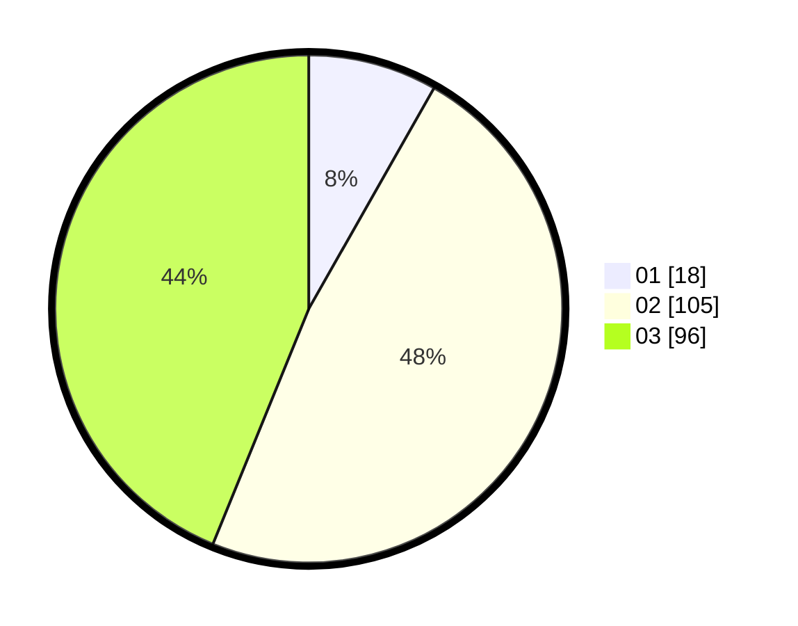

# Hasil

Hasil perolehan suara paslon dapat dilihat pada file paslon-01.txt, paslon-02.txt, dan paslon-03.txt.

Jika tidak ada, artinya data tersebut belum ada pada SIREKAP.

## Perolehan Suara

 * Paslon 01: **18**.
 * Paslon 02: **105**.
 * Paslon 03: **96**.

## Foto C Plano

https://sirekap-obj-formc.kpu.go.id/134e/pemilu/ppwp/31/71/04/10/02/3171041002002-20240216-012950--ebd25e92-0f56-4e39-902d-03f671b508e1.jpg

https://sirekap-obj-formc.kpu.go.id/134e/pemilu/ppwp/31/71/04/10/02/3171041002002-20240216-012951--d2fe7422-42ca-49d9-8d4a-a23500053737.jpg

https://sirekap-obj-formc.kpu.go.id/134e/pemilu/ppwp/31/71/04/10/02/3171041002002-20240216-012950--e9c57272-fe27-43b8-b865-09a1fed7673d.jpg

## DATA PEMILIH TETAP

Jumlah pemilih dalam DPT: **258**.
 * L: **129**.
 * P: **129**.

## DATA PENGGUNA HAK PILIH

Jumlah pengguna hak pilih dalam DPT: **193**.
 * L: **92**.
 * P: **101**.

Jumlah pengguna hak pilih dalam DPTb: **21**.
 * L: **6**.
 * P: **15**.

Jumlah pengguna hak pilih dalam DPK: **7**.
 * L: **2**.
 * P: **5**.

Jumlah pengguna hak pilih: **221**.
 * L: **100**.
 * P: **121**.

## JUMLAH SUARA SAH DAN TIDAK SAH

JUMLAH SELURUH SUARA SAH: **219**.

JUMLAH SUARA TIDAK SAH: **2**.

JUMLAH SELURUH SUARA SAH DAN SUARA TIDAK SAH: **221**.
