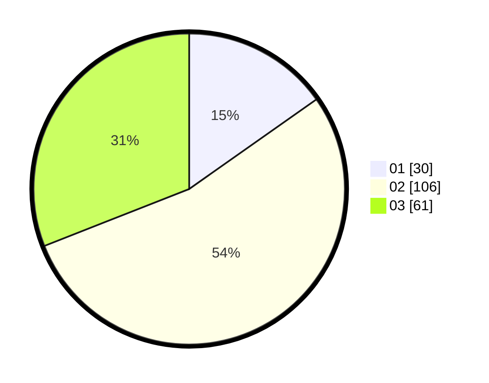

# Hasil

Hasil perolehan suara paslon dapat dilihat pada file paslon-01.txt, paslon-02.txt, dan paslon-03.txt.

Jika tidak ada, artinya data tersebut belum ada pada SIREKAP.

## Perolehan Suara

 * Paslon 01: **30**.
 * Paslon 02: **106**.
 * Paslon 03: **61**.

## Foto C Plano

https://sirekap-obj-formc.kpu.go.id/f93b/pemilu/ppwp/31/71/04/10/02/3171041002003-20240216-064421--4dcd8621-2add-44aa-b579-a1fe0a7c2b93.jpg

https://sirekap-obj-formc.kpu.go.id/f93b/pemilu/ppwp/31/71/04/10/02/3171041002003-20240216-064426--e9d4f4cf-c47e-4622-8482-146041bdcf84.jpg

https://sirekap-obj-formc.kpu.go.id/f93b/pemilu/ppwp/31/71/04/10/02/3171041002003-20240216-064423--dc2005d5-5642-4c2b-b07a-7a78b5ea4a21.jpg

## DATA PEMILIH TETAP

Jumlah pemilih dalam DPT: **273**.
 * L: **125**.
 * P: **148**.

## DATA PENGGUNA HAK PILIH

Jumlah pengguna hak pilih dalam DPT: **166**.
 * L: **74**.
 * P: **92**.

Jumlah pengguna hak pilih dalam DPTb: **28**.
 * L: **20**.
 * P: **8**.

Jumlah pengguna hak pilih dalam DPK: **3**.
 * L: **2**.
 * P: **1**.

Jumlah pengguna hak pilih: **197**.
 * L: **96**.
 * P: **101**.

## JUMLAH SUARA SAH DAN TIDAK SAH

JUMLAH SELURUH SUARA SAH: **197**.

JUMLAH SUARA TIDAK SAH: **0**.

JUMLAH SELURUH SUARA SAH DAN SUARA TIDAK SAH: **197**.
