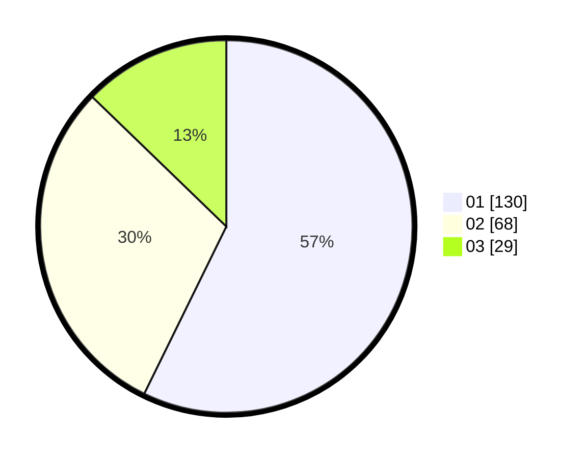

# Hasil

Hasil perolehan suara paslon dapat dilihat pada file paslon-01.txt, paslon-02.txt, dan paslon-03.txt.

Jika tidak ada, artinya data tersebut belum ada pada SIREKAP.

## Perolehan Suara

 * Paslon 01: **130**.
 * Paslon 02: **68**.
 * Paslon 03: **29**.

## Foto C Plano

https://sirekap-obj-formc.kpu.go.id/c9b7/pemilu/ppwp/31/71/04/10/02/3171041002008-20240215-002217--25a4b4da-56f3-49d7-9427-1a0be3803c89.jpg

https://sirekap-obj-formc.kpu.go.id/c9b7/pemilu/ppwp/31/71/04/10/02/3171041002008-20240215-002045--f51a9150-fff8-42ad-bf58-cb0a41aed131.jpg

https://sirekap-obj-formc.kpu.go.id/c9b7/pemilu/ppwp/31/71/04/10/02/3171041002008-20240215-002331--53048a1e-e922-40ad-a107-a4f5030ac246.jpg

## DATA PEMILIH TETAP

Jumlah pemilih dalam DPT: **277**.
 * L: **145**.
 * P: **132**.

## DATA PENGGUNA HAK PILIH

Jumlah pengguna hak pilih dalam DPT: **211**.
 * L: **109**.
 * P: **102**.

Jumlah pengguna hak pilih dalam DPTb: **19**.
 * L: **6**.
 * P: **13**.

Jumlah pengguna hak pilih dalam DPK: **1**.
 * L: **0**.
 * P: **1**.

Jumlah pengguna hak pilih: **231**.
 * L: **115**.
 * P: **116**.

## JUMLAH SUARA SAH DAN TIDAK SAH

JUMLAH SELURUH SUARA SAH: **227**.

JUMLAH SUARA TIDAK SAH: **4**.

JUMLAH SELURUH SUARA SAH DAN SUARA TIDAK SAH: **231**.
