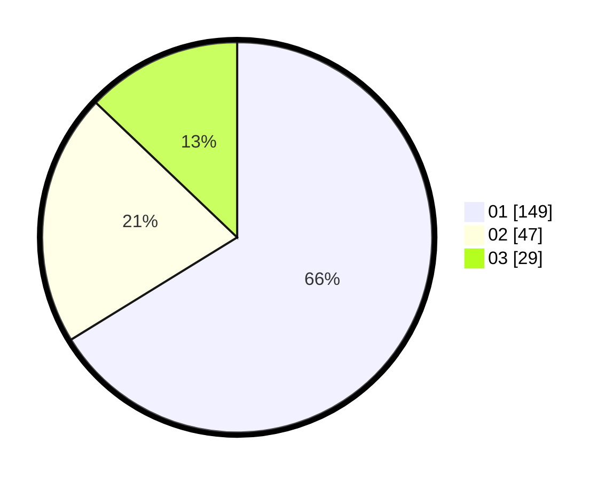

# Hasil

Hasil perolehan suara paslon dapat dilihat pada file paslon-01.txt, paslon-02.txt, dan paslon-03.txt.

Jika tidak ada, artinya data tersebut belum ada pada SIREKAP.

## Perolehan Suara

 * Paslon 01: **149**.
 * Paslon 02: **47**.
 * Paslon 03: **29**.

## Foto C Plano

https://sirekap-obj-formc.kpu.go.id/0d9a/pemilu/ppwp/31/71/04/10/02/3171041002009-20240214-214153--b5922560-bb32-40bd-8303-42cf3a614929.jpg

https://sirekap-obj-formc.kpu.go.id/0d9a/pemilu/ppwp/31/71/04/10/02/3171041002009-20240214-214104--2c788705-7d24-4195-be52-c2e04e13df18.jpg

https://sirekap-obj-formc.kpu.go.id/0d9a/pemilu/ppwp/31/71/04/10/02/3171041002009-20240218-144129--832928d3-9da1-4976-afef-d94d0c3a9d4e.jpg
