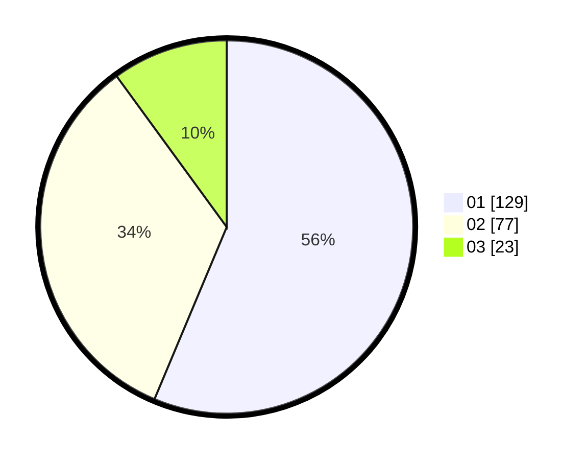

# Hasil

Hasil perolehan suara paslon dapat dilihat pada file paslon-01.txt, paslon-02.txt, dan paslon-03.txt.

Jika tidak ada, artinya data tersebut belum ada pada SIREKAP.

## Perolehan Suara

 * Paslon 01: **129**.
 * Paslon 02: **77**.
 * Paslon 03: **23**.

## Foto C Plano

https://sirekap-obj-formc.kpu.go.id/f80a/pemilu/ppwp/31/71/04/10/02/3171041002010-20240214-204305--53a716db-85d6-4ffb-b18d-bb0ba3016009.jpg

https://sirekap-obj-formc.kpu.go.id/f80a/pemilu/ppwp/31/71/04/10/02/3171041002010-20240214-204448--b150d3a9-808c-4bc4-b050-2e71e068e135.jpg

https://sirekap-obj-formc.kpu.go.id/f80a/pemilu/ppwp/31/71/04/10/02/3171041002010-20240214-204557--f4689033-fb82-4bba-b288-f1374b7914c8.jpg

## DATA PEMILIH TETAP

Jumlah pemilih dalam DPT: **269**.
 * L: **135**.
 * P: **134**.

## DATA PENGGUNA HAK PILIH

Jumlah pengguna hak pilih dalam DPT: **222**.
 * L: **109**.
 * P: **113**.

Jumlah pengguna hak pilih dalam DPTb: **8**.
 * L: **3**.
 * P: **5**.

Jumlah pengguna hak pilih dalam DPK: **3**.
 * L: **2**.
 * P: **1**.

Jumlah pengguna hak pilih: **233**.
 * L: **114**.
 * P: **119**.

## JUMLAH SUARA SAH DAN TIDAK SAH

JUMLAH SELURUH SUARA SAH: **229**.

JUMLAH SUARA TIDAK SAH: **4**.

JUMLAH SELURUH SUARA SAH DAN SUARA TIDAK SAH: **233**.
