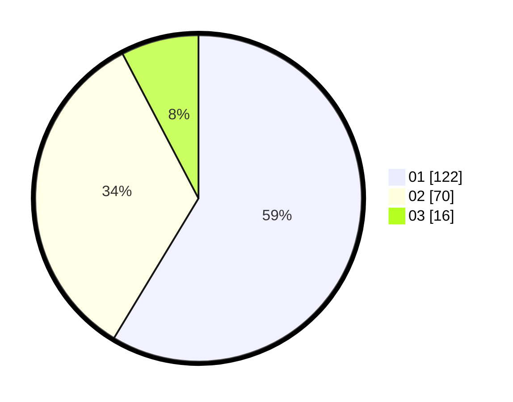

# Hasil

Hasil perolehan suara paslon dapat dilihat pada file paslon-01.txt, paslon-02.txt, dan paslon-03.txt.

Jika tidak ada, artinya data tersebut belum ada pada SIREKAP.

## Perolehan Suara

 * Paslon 01: **122**.
 * Paslon 02: **70**.
 * Paslon 03: **16**.

## Foto C Plano

https://sirekap-obj-formc.kpu.go.id/4a9f/pemilu/ppwp/31/71/04/10/02/3171041002018-20240217-221620--8d33bbee-5cd2-4d7f-a7d6-1e78d5a17631.jpg

https://sirekap-obj-formc.kpu.go.id/4a9f/pemilu/ppwp/31/71/04/10/02/3171041002018-20240214-231527--e09dbd0b-cf45-41c7-abbc-4b4c5e11347c.jpg

https://sirekap-obj-formc.kpu.go.id/4a9f/pemilu/ppwp/31/71/04/10/02/3171041002018-20240214-231638--911dbc4b-efd7-4dce-b871-716edb859b82.jpg

## DATA PEMILIH TETAP

Jumlah pemilih dalam DPT: **278**.
 * L: **131**.
 * P: **147**.

## DATA PENGGUNA HAK PILIH

Jumlah pengguna hak pilih dalam DPT: **213**.
 * L: **101**.
 * P: **112**.

Jumlah pengguna hak pilih dalam DPTb: **1**.
 * L: **0**.
 * P: **1**.

Jumlah pengguna hak pilih dalam DPK: **0**.
 * L: **0**.
 * P: **0**.

Jumlah pengguna hak pilih: **214**.
 * L: **101**.
 * P: **113**.

## JUMLAH SUARA SAH DAN TIDAK SAH

JUMLAH SELURUH SUARA SAH: **208**.

JUMLAH SUARA TIDAK SAH: **6**.

JUMLAH SELURUH SUARA SAH DAN SUARA TIDAK SAH: **214**.
