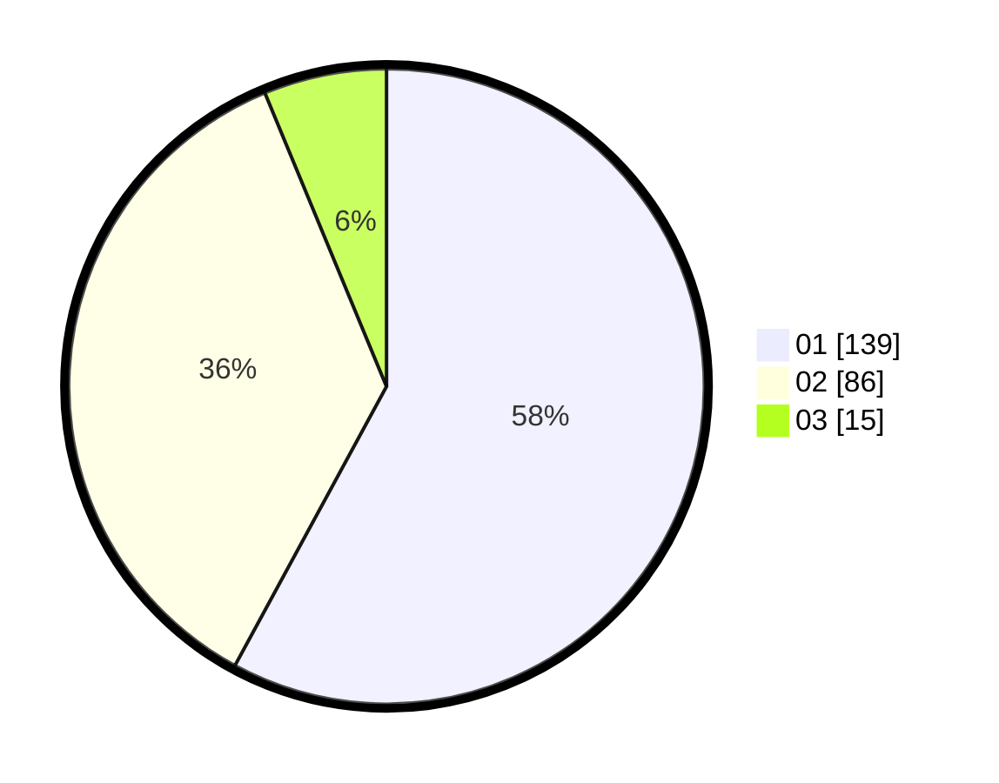

# Hasil

Hasil perolehan suara paslon dapat dilihat pada file paslon-01.txt, paslon-02.txt, dan paslon-03.txt.

Jika tidak ada, artinya data tersebut belum ada pada SIREKAP.

## Perolehan Suara

 * Paslon 01: **139**.
 * Paslon 02: **86**.
 * Paslon 03: **15**.

## Foto C Plano

https://sirekap-obj-formc.kpu.go.id/0522/pemilu/ppwp/31/71/04/10/02/3171041002019-20240214-194816--c31b9895-2834-4289-afdb-58ce03535ba5.jpg

https://sirekap-obj-formc.kpu.go.id/0522/pemilu/ppwp/31/71/04/10/02/3171041002019-20240215-231650--e45ea5a2-d10c-4f0d-adf4-313d4ab228c5.jpg

https://sirekap-obj-formc.kpu.go.id/0522/pemilu/ppwp/31/71/04/10/02/3171041002019-20240214-194850--68c91574-6441-43cc-94a9-00147a81cf97.jpg

## DATA PEMILIH TETAP

Jumlah pemilih dalam DPT: **278**.
 * L: **131**.
 * P: **147**.

## DATA PENGGUNA HAK PILIH

Jumlah pengguna hak pilih dalam DPT: **233**.
 * L: **111**.
 * P: **122**.

Jumlah pengguna hak pilih dalam DPTb: **4**.
 * L: **3**.
 * P: **1**.

Jumlah pengguna hak pilih dalam DPK: **4**.
 * L: **2**.
 * P: **2**.

Jumlah pengguna hak pilih: **241**.
 * L: **116**.
 * P: **125**.

## JUMLAH SUARA SAH DAN TIDAK SAH

JUMLAH SELURUH SUARA SAH: **240**.

JUMLAH SUARA TIDAK SAH: **1**.

JUMLAH SELURUH SUARA SAH DAN SUARA TIDAK SAH: **241**.
