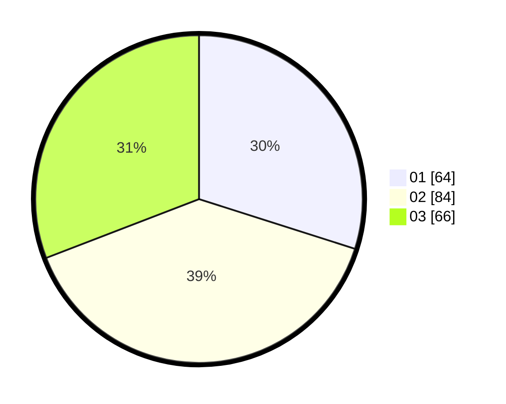

# Hasil

Hasil perolehan suara paslon dapat dilihat pada file paslon-01.txt, paslon-02.txt, dan paslon-03.txt.

Jika tidak ada, artinya data tersebut belum ada pada SIREKAP.

## Perolehan Suara

 * Paslon 01: **64**.
 * Paslon 02: **84**.
 * Paslon 03: **66**.

## Foto C Plano

https://sirekap-obj-formc.kpu.go.id/8fe2/pemilu/ppwp/31/71/04/10/02/3171041002023-20240216-145935--17acef40-cd0d-4ac4-83d2-7c0c3dec9ecb.jpg

https://sirekap-obj-formc.kpu.go.id/8fe2/pemilu/ppwp/31/71/04/10/02/3171041002023-20240216-150046--4ca21796-fbb1-4205-accb-f3f79aa9bb77.jpg

https://sirekap-obj-formc.kpu.go.id/8fe2/pemilu/ppwp/31/71/04/10/02/3171041002023-20240216-123546--870a0b6a-c7cc-4c3f-afe8-af69e259942a.jpg

## DATA PEMILIH TETAP

Jumlah pemilih dalam DPT: **262**.
 * L: **122**.
 * P: **140**.

## DATA PENGGUNA HAK PILIH

Jumlah pengguna hak pilih dalam DPT: **182**.
 * L: **83**.
 * P: **99**.

Jumlah pengguna hak pilih dalam DPTb: **23**.
 * L: **8**.
 * P: **15**.

Jumlah pengguna hak pilih dalam DPK: **13**.
 * L: **7**.
 * P: **6**.

Jumlah pengguna hak pilih: **218**.
 * L: **98**.
 * P: **120**.

## JUMLAH SUARA SAH DAN TIDAK SAH

JUMLAH SELURUH SUARA SAH: **214**.

JUMLAH SUARA TIDAK SAH: **4**.

JUMLAH SELURUH SUARA SAH DAN SUARA TIDAK SAH: **218**.
