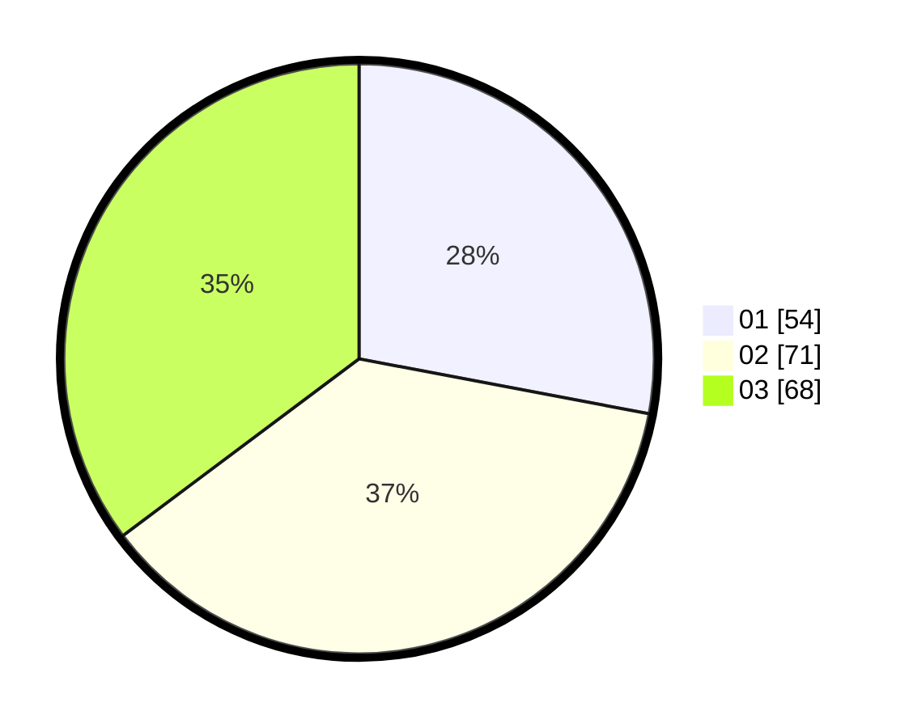

# Hasil

Hasil perolehan suara paslon dapat dilihat pada file paslon-01.txt, paslon-02.txt, dan paslon-03.txt.

Jika tidak ada, artinya data tersebut belum ada pada SIREKAP.

## Perolehan Suara

 * Paslon 01: **54**.
 * Paslon 02: **71**.
 * Paslon 03: **68**.

## Foto C Plano

https://sirekap-obj-formc.kpu.go.id/211a/pemilu/ppwp/31/71/04/10/02/3171041002024-20240215-022441--a569309c-8cd4-40e9-bb0a-1e4d74f6f7d1.jpg

https://sirekap-obj-formc.kpu.go.id/211a/pemilu/ppwp/31/71/04/10/02/3171041002024-20240215-022454--ea4feaaf-ab76-49db-a663-a68cef968b44.jpg

https://sirekap-obj-formc.kpu.go.id/211a/pemilu/ppwp/31/71/04/10/02/3171041002024-20240215-022502--664ef8b3-f78d-470e-9ae5-b0700b3715d6.jpg

## DATA PEMILIH TETAP

Jumlah pemilih dalam DPT: **254**.
 * L: **123**.
 * P: **131**.

## DATA PENGGUNA HAK PILIH

Jumlah pengguna hak pilih dalam DPT: **164**.
 * L: **74**.
 * P: **90**.

Jumlah pengguna hak pilih dalam DPTb: **29**.
 * L: **24**.
 * P: **5**.

Jumlah pengguna hak pilih dalam DPK: **4**.
 * L: **2**.
 * P: **2**.

Jumlah pengguna hak pilih: **197**.
 * L: **100**.
 * P: **97**.

## JUMLAH SUARA SAH DAN TIDAK SAH

JUMLAH SELURUH SUARA SAH: **193**.

JUMLAH SUARA TIDAK SAH: **4**.

JUMLAH SELURUH SUARA SAH DAN SUARA TIDAK SAH: **197**.
